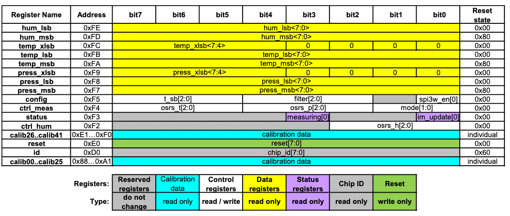

# BME280データシート

[オリジナル](BST-BME280-DS002-1509607.pdf)

## 4.2 出力補正

BME280の出力はADC出力値で構成されています。しかし、各センシング素子の
動作は異なります。したがって、実際の気圧と温度は一連の校正パラメータを
使用して計算する必要があります。本章では、トリミング値を読み出す方法を
説明します。推奨する計算法では固定小数点演算を使用し、これは4.2.3章で
説明します。

Matlab<sup>TM</sup>やLabVIEW<sup>TM</sup>のような高級言語では固定
小数点コードは十分にサポートされていない場合があります。その場合は
付録8.1の浮動小数点コードを代わりに使用することができます。

8ビットマイクロコントローラの場合、変数サイズが制限されることが
あります。この場合は精度を下げた簡略化された32ビット整数コードが
付録8.2に記載されています。

### 4.2.1 計算要件

以下の表には、32ビットCortex-M3マイクロコントローラでGCCを最適化
レベル-O2で使用した場合に補正に必要なクロックサイクルの概数を
示しています。このコントローラは浮動小数点ユニットを備えていない
ので浮動小数点計算はすべてエミュレートされます。浮動小数点はPC
アプリケーションでのみ推奨されます。PCにはPUが存在し、これらの
計算は劇的に高速に実行されます。

<center>表15. 補正式の計算要件</center>

| 補正対象 | <br/>32ビットInt |クロック数<br/>64ビットInt | <br/>倍精度 |
|:------|:-----------:|:-----------:|:------:|
| 湿度 | ~ 83 | - | = 2900^11 |
| 温度 | ~ 46 | - | ~ 2400^11 |
| 気圧 | ~ 112^12 | ~ 1400 | ~ 5400^11 |

### 4.2.2 トリミングパラメータの読み出し

トリミングパラメーターは製造中にデバイスの不揮発性メモリー（NVM）に
プログラムされており、顧客が変更することはできません。各補正ワードは
2の補数で格納された16ビットの符号付き整数値または符号なし整数値です。
メモリは8ビットワードで構成されているため、補正ワードを表現するには
常に2つのワードを組み合わせる必要があります。8 ビットレジスタは
`calib00` ... `calib41` と名付けられており、メモリアドレス `0x88` ...
`0xA1` と `0xE1` ... `0xE7` に格納されています。対応する補正ワードは
温度補正に関する値は `dig_T#`、気圧補正に関する値は `dig_P#`、
湿度補正に関する値は `dig_H#` と名付けられています。マッピングを
表16に示しました。

<center>表16. 補正パラメタのアドレス、名前、データ型</center>

| レジスタアドレス | レジスタ内容 | データ型 |
|:-----:|:-----------:|:-----------:|
| 0x88/0x89 | dig_T1 [7:0]/[15:8] | unsigned short |
| 0x8A/0x8B | dig_T2 [7:0]/[15:8] | signed short |
| 0x8C/0x8D | dig_T3 [7:0]/[15:8] | signed short |
| 0x8E/0x8F | dig_P1 [7:0]/[15:8] | unsigned short |
| 0x90/0x91 | dig_P2 [7:0]/[15:8] | signed short |
| 0x92/0x93 | dig_P3 [7:0]/[15:8] | signed short |
| 0x94/0x95 | dig_P4 [7:0]/[15:8] | signed short |
| 0x96/0x97 | dig_P5 [7:0]/[15:8] | signed short |
| 0x98/0x99 | dig_P6 [7:0]/[15:8] | signed short |
| 0x9A/0x9B | dig_P7 [7:0]/[15:8] | signed short |
| 0x9C/0x9D | dig_P8 [7:0]/[15:8] | signed short |
| 0x9E/0x9F | dig_P9 [7:0]/[15:8] | signed short |
| 0xA1 | dig_H1 [7:0] | unsigned char |
| 0xE1/0xE2 | dig_H2 [7:0]/[15:8] | signed short |
| 0xE3 | dig_H3 [7:0] | unsigned char |
| 0xE4/0xE5[3:0] | dig_H4 [11:4]/[3:0] | signed short |
| 0xE5[7:4]/0xE6 | dig_H5 [3:0]/[11:4] | signed short |
| 0xE7 | dig_H6  | signed char |

### 4.2.3 補正計算式

読み出しと補正の実行にはosch SensortecのAPIを使用することを強く勧めます。
これを希望されない場合はユーザの責任において以下のコードを適用してください。
気圧と温度の値はどちらも 20ビットフォーマットの正値で受信され、32ビット
符号付き整数に格納されます。湿度は16ビットフォーマットの正値で受信され、
32ビット符号付き整数で保存されます。

変数t_fine（符号付き32ビット）は、高い分解能の温度値を持ち、気圧と湿度の
補正式に使用するようグローバル変数として実装することができます。

データ型"BME280_S32_t"は32ビット符号付き整数変数型を定義する必要があり、
通常は、"long signed int"で定義できます。

データ型"BME280_U32_t"は32ビット符号なし整数変数型を定義する必要があり、
通常は "long unsigned int"で定義できます。

気圧の計算精度を最大限に高めるには、64ビット整数のサポートが必要です。
使用するプラットフォームでこれが不可能な場合は、付録8.2に示した32ビットの
代替を参照してください。

データ型"BME280_S64_t"は64ビット符号付き整数変数型を定義する必要があり、
ほとんどのサポ ートプラットフォームでは "long long signed int"で定義
できます。コードのリビジョンは rev.1.1 です。

```c
// 温度を度Cで返す。分解能は0.01度C。
// 出力値"5123"は, 51.23 度Cに等しい。
// t_fineはグローバルな値として高細温度を保持する
BME280_S32_t t_fine;
BME280_S32_t BME280_compensate_T_int32(BME280_S32_t adc_T) {
    BME280_S32_t var1, var2, T;
    var1 = ((((adc_T >> 3) – ((BME280_S32_t)dig_T1 << 1))) *
            ((BME280_S32_t)dig_T2)) >> 11;
    var2 = (((((adc_T >> 4) – ((BME280_S32_t)dig_T1)) *
              ((adc_T >> 4) – ((BME280_S32_t)dig_T1))) >>
             12) * ((BME280_S32_t)dig_T3)) >> 14;
    t_fine = var1 + var2;
    T = (t_fine * 5 + 128) >> 8;
    return T;
}
// Q24.8形式（24の整数ビットと8の小数ビット）の符号なし32ビット整数と
// してPa単位の気圧を返す。
// 出力値"24674867"は、24674867/256 = 96386.2 Pa = 963.862 hPaを表します。
BME280_U32_t BME280_compensate_P_int64(BME280_S32_t adc_P)
{
    BME280_S64_t var1, var2, p;
    var1 = ((BME280_S64_t)t_fine) – 128000;
    var2 = var1 * var1 * (BME280_S64_t)dig_P6;
    var2 = var2 + ((var1 * (BME280_S64_t)dig_P5) << 17);
    var2 = var2 + (((BME280_S64_t)dig_P4) << 35);
    var1 = ((var1 * var1 * (BME280_S64_t)dig_P3) >> 8) +
           ((var1 * (BME280_S64_t)dig_P2) << 12);
    var1 = (((((BME280_S64_t)1) << 47) + var1)) * ((BME280_S64_t)dig_P1) >> 33;
    if (var1 == 0) {
        return 0;  // avoid exception caused by division by zero
    }
    p = 1048576 - adc_P;
    p = (((p << 31) - var2) * 3125) / var1;
    var1 = (((BME280_S64_t)dig_P9) * (p >> 13) * (p >> 13)) >> 25;
    var2 = (((BME280_S64_t)dig_P8) * p) >> 19;
    p = ((p + var1 + var2) >> 8) + (((BME280_S64_t)dig_P7) << 4);
    return (BME280_U32_t)p;
}
// Q22.10フォーマット（22の整数ビットと10の小数ビット）の符号なし
// 32ビット整数として湿度を%RHで返す。
// 出力値"474452は、47445/1024 = 46.333 %RHを表します。
BME280_U32_t bme280_compensate_H_int32(BME280_S32_t adc_H)
{
    BME280_S32_t v_x1_u32r;
    v_x1_u32r = (t_fine – ((BME280_S32_t)76800));
    v_x1_u32r = (((((adc_H << 14) – (((BME280_S32_t)dig_H4) << 20) – (
                       ((BME280_S32_t)dig_H5) * v_x1_u32r)) +
                   ((BME280_S32_t)16384)) >> 15) *
                 (((((((v_x1_u32r * ((BME280_S32_t)dig_H6)) >> 10) *
                      (((v_x1_u32r * ((BME280_S32_t)dig_H3)) >> 11) +
                       ((BME280_S32_t)32768))) >> 10) +
                    ((BME280_S32_t)2097152)) * ((BME280_S32_t)dig_H2) + 8192) >> 14));
    v_x1_u32r = (v_x1_u32r – (((((v_x1_u32r >> 15) * (v_x1_u32r >> 15)) >> 7) *
                               ((BME280_S32_t)dig_H1)) >>
                              4));
    v_x1_u32r = (v_x1_u32r < 0 ? 0 : v_x1_u32r);
    v_x1_u32r = (v_x1_u32r > 419430400 ? 419430400 : v_x1_u32r);
    return (BME280_U32_t)(v_x1_u32r >> 12);
}
```

# 5. グローバルメモリマップとレジスタの説明

## 5.1 一般的な注意事項

デバイスとの通信はすべてレジスタの読み書きで行われます。レジスタの幅は
8ビットです。予約済のレジスタがいくつか存在するがこれらのレジスタには
書き込んではならない。また、読み込んでも特定の値は保証されません。
インタフェースの詳細については第6章を参照してください。

## 5.2 BMP280とのレジスタ互換性

BME280はBMP280と下位レジスタ互換です。気圧と温度の制御と読み出しは
BMP280と同じです。ただし、以下の例外を考慮する必要があります。

<center>表17. BMP280とBME280のレジスタの相違</center>

| レジスタ | ビット | 内容 | BMP280 | BME280 |
|:--------:|-------:|:----:|:-------|:-------|
| 0xD0 “id” | 7:0 | chip_id | Read値は<br/>0x56 / 0x57 (samples)<br/>0x58 (mass production) | Read値は 0x60 |
| 0xF5 “config” | 7:5 | t_sb | ‘110’: 2000 ms<br/>‘111’: 4000 ms | ‘110’: 10 ms<br/>‘111’: 20 ms |
| 0xF7…0xF9 “press” | 19:0 | 気圧 | 分解能 (16…20 ビット)はosrs_pにのみ依存 | フィルタのない場合、分解能はosrs_pに依存; フィルタを使う場合、分解能は常に20ビット |
| 0xFA…0xFC “temp” | 19:0 | 温度 | 分解能 (16…20 ビット)osrs_tにのみ依存 | ィルタのない場合、分解能はosrs_tに依存; フィルタを使う場合、分解能は常に20ビット |

## 5.3 メモリマップ

メモリマップを表18に示した。予約済レジスタは示していない。

<center>表18. メモリマップ</center>


