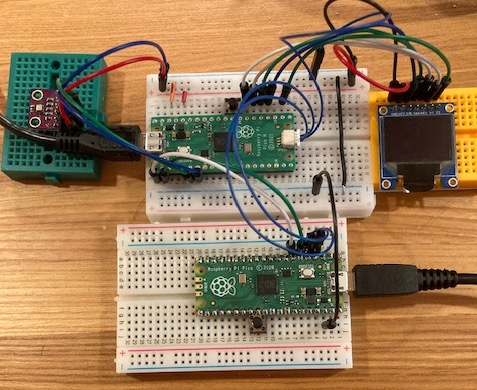
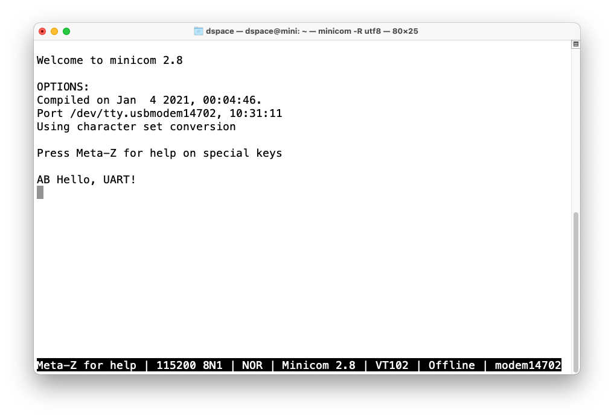
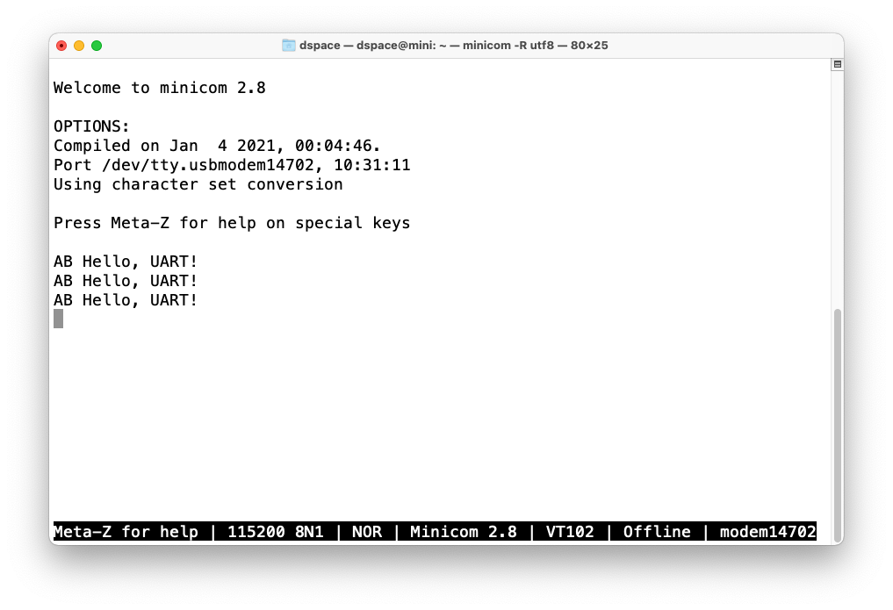

# debugprobeを使う

## 0. セットアップ

[Getting started with Raspberry Pi Pico](https://datasheets.raspberrypi.com/pico/getting-started-with-pico.pdf)
"Appendix A: Using Picoprobe"に基づいて行う。ただし、`picoprobe`は`debugprobe`と
いう名前に変わっている。

### 0.1 openocdのインストール

```bash
$ brew install libtool automake libusb wget pkg-config gcc texinfo
$ cd ~/pico
$ git clone https://github.com/raspberrypi/openocd.git --branch rp2040-v0.12.0 --depth=1
$ cd openocd
$ export PATH="/usr/local/opt/texinfo/bin:$PATH"
$ ./bootstrap
$ ./configure --disable-werror
$ make
$ src/openocd
Open On-Chip Debugger 0.12.0-g4d87f6d (2024-02-21-18:38)
Licensed under GNU GPL v2
For bug reports, read
	http://openocd.org/doc/doxygen/bugs.html
embedded:startup.tcl:28: Error: Can't find openocd.cfg
in procedure 'script'
at file "embedded:startup.tcl", line 28
Info : Listening on port 6666 for tcl connections
Info : Listening on port 4444 for telnet connections
Error: Debug Adapter has to be specified, see "adapter driver" command
embedded:startup.tcl:28: Error:
in procedure 'script'
at file "embedded:startup.tcl", line 28
```

### 0.2 debugprobeのビルドと書き込み

```bash
$ cd ~/pico
$ git clone https://github.com/raspberrypi/debugprobe.git
$ cd debugprobe
$ git submodule update --init
$ mkdir build
$ cd build
$ export PICO_SDK_PATH=../../pico-sdk
$ cmake -DDEBUG_ON_PICO=ON ..
$ make
$ picotool load debugprobe_on_pico.uf2
```

### 0.3 ワイヤリング

```bash
# Pico A: debugprobe, Pico B: 開発対象のPico

Pico A GND -> Pico B GND
Pico A GP2 -> Pico B SWCLK
Pico A GP3 -> Pico B SWDIO
Pico A GP4/UART1 TX -> Pico B GP1/UART0 RX
Pico A GP5/UART1 RX -> Pico B GP0/UART0 T
```



### 0.4 minicomの設定

```bash
$ vi ~/.minirc.dfl
pu port	/dev/tty.usbmodem14702
pu baudrate	115200
```

## 1. プログラムのロードと実行

```bash
$ ~/pico/openocd/src/openocd  -f interface/cmsis-dap.cfg \
	-c "adapter speed 5000" -f target/rp2040.cfg -s /Users/dspace/pico/openocd/tcl \
	-c "program uart/hello_uart/hello_uart.elf verify reset exit"
Open On-Chip Debugger 0.12.0-g4d87f6d (2024-02-21-18:38)
Licensed under GNU GPL v2
For bug reports, read
	http://openocd.org/doc/doxygen/bugs.html
adapter speed: 5000 kHz

Info : Hardware thread awareness created
Info : Hardware thread awareness created
Info : Using CMSIS-DAPv2 interface with VID:PID=0x2e8a:0x000c, serial=E6616407E37E8E28
Info : CMSIS-DAP: SWD supported
Info : CMSIS-DAP: Atomic commands supported
Info : CMSIS-DAP: Test domain timer supported
Info : CMSIS-DAP: FW Version = 2.0.0
Info : CMSIS-DAP: Interface Initialised (SWD)
Info : SWCLK/TCK = 0 SWDIO/TMS = 0 TDI = 0 TDO = 0 nTRST = 0 nRESET = 0
Info : CMSIS-DAP: Interface ready
Info : clock speed 5000 kHz
Info : SWD DPIDR 0x0bc12477, DLPIDR 0x00000001
Info : SWD DPIDR 0x0bc12477, DLPIDR 0x10000001
Info : [rp2040.core0] Cortex-M0+ r0p1 processor detected
Info : [rp2040.core0] target has 4 breakpoints, 2 watchpoints
Info : [rp2040.core1] Cortex-M0+ r0p1 processor detected
Info : [rp2040.core1] target has 4 breakpoints, 2 watchpoints
Info : starting gdb server for rp2040.core0 on 3333
Info : Listening on port 3333 for gdb connections
[rp2040.core0] halted due to debug-request, current mode: Thread
xPSR: 0xf1000000 pc: 0x000000ea msp: 0x20041f00
[rp2040.core1] halted due to debug-request, current mode: Thread
xPSR: 0xf1000000 pc: 0x000000ea msp: 0x20041f00
** Programming Started **
Info : Found flash device 'win w25q16jv' (ID 0x001540ef)
Info : RP2040 B0 Flash Probe: 2097152 bytes @0x10000000, in 32 sectors

Info : Padding image section 1 at 0x100022d8 with 40 bytes (bank write end alignment)
Warn : Adding extra erase range, 0x10002300 .. 0x1000ffff
** Programming Finished **
** Verify Started **
** Verified OK **
** Resetting Target **
shutdown command invoked
```

```bash
$ minicom
```



## 2. デバッグ

"Chapter 6. Debugging with SWD"に基づいて行う。ただし、`openocd`のパラメタはdebugprobe用に
変更する。

## 2.1 pico-exmaplesをデバッグモードで再編成する

```bash
$ cd ~/pico/pico-examples
$ rm -rf build
$ mkdir build
$ cd build
$ export PICO_SDK_PATH=../../pico-sdk
$ cmake -DCMAKE_BUILD_TYPE=Debug ..
$ cd hello_world/serial
$ make
```

### 2.3.1 実行

#### 2.3.1.1 openocd


```bash
$ ~/pico/openocd/src/openocd  -f interface/cmsis-dap.cfg \
	-c "adapter speed 5000" -f target/rp2040.cfg \
	-s /Users/dspace/pico/openocd/tcl
Open On-Chip Debugger 0.12.0-g4d87f6d (2024-02-21-18:38)
Licensed under GNU GPL v2
For bug reports, read
	http://openocd.org/doc/doxygen/bugs.html
adapter speed: 5000 kHz

Info : Hardware thread awareness created
Info : Hardware thread awareness created
Info : Listening on port 6666 for tcl connections
Info : Listening on port 4444 for telnet connections
Info : Using CMSIS-DAPv2 interface with VID:PID=0x2e8a:0x000c, serial=E6616407E37E8E28
Info : CMSIS-DAP: SWD supported
Info : CMSIS-DAP: Atomic commands supported
Info : CMSIS-DAP: Test domain timer supported
Info : CMSIS-DAP: FW Version = 2.0.0
Info : CMSIS-DAP: Interface Initialised (SWD)
Info : SWCLK/TCK = 0 SWDIO/TMS = 0 TDI = 0 TDO = 0 nTRST = 0 nRESET = 0
Info : CMSIS-DAP: Interface ready
Info : clock speed 5000 kHz
Info : SWD DPIDR 0x0bc12477, DLPIDR 0x00000001
Info : SWD DPIDR 0x0bc12477, DLPIDR 0x10000001
Info : [rp2040.core0] Cortex-M0+ r0p1 processor detected
Info : [rp2040.core0] target has 4 breakpoints, 2 watchpoints
Info : [rp2040.core1] Cortex-M0+ r0p1 processor detected
Info : [rp2040.core1] target has 4 breakpoints, 2 watchpoints
Info : starting gdb server for rp2040.core0 on 3333
Info : Listening on port 3333 for gdb connections
Info : accepting 'gdb' connection on tcp/3333
Info : Found flash device 'win w25q16jv' (ID 0x001540ef)
Info : RP2040 B0 Flash Probe: 2097152 bytes @0x10000000, in 32 sectors

Info : New GDB Connection: 1, Target rp2040.core0, state: halted
Warn : Prefer GDB command "target extended-remote :3333" instead of "target remote :3333"
Info : SWD DPIDR 0x0bc12477, DLPIDR 0x00000001
Error: Failed to read memory at 0x20042000
[rp2040.core1] halted due to debug-request, current mode: Thread
xPSR: 0x01000000 pc: 0x00000184 msp: 0x20041f00
[rp2040.core0] halted due to debug-request, current mode: Thread
xPSR: 0xf1000000 pc: 0x000000ea msp: 0x20041f00
[rp2040.core1] halted due to debug-request, current mode: Thread
xPSR: 0xf1000000 pc: 0x000000ea msp: 0x20041f00
[rp2040.core1] halted due to debug-request, current mode: Thread
xPSR: 0x01000000 pc: 0x00000184 msp: 0x20041f00
Info : SWD DPIDR 0x0bc12477, DLPIDR 0x00000001
Error: Failed to read memory at 0x20042000
[rp2040.core0] halted due to debug-request, current mode: Thread
xPSR: 0xf1000000 pc: 0x000000ea msp: 0x20041f00
[rp2040.core1] halted due to debug-request, current mode: Thread
xPSR: 0xf1000000 pc: 0x000000ea msp: 0x20041f00
[rp2040.core1] halted due to debug-request, current mode: Thread
xPSR: 0x01000000 pc: 0x00000184 msp: 0x20041f00
[rp2040.core1] halted due to debug-request, current mode: Thread
xPSR: 0x01000000 pc: 0x00000184 msp: 0x20041f00
Info : SWD DPIDR 0x0bc12477, DLPIDR 0x00000001
Error: Failed to read memory at 0x20042000
Info : dropped 'gdb' connection
## CNTL-c で終了
```

#### 2.3.1.2 gdb

```bash
$ gdb hello_serial.elf
GNU gdb (GDB) 13.1
Copyright (C) 2023 Free Software Foundation, Inc.
License GPLv3+: GNU GPL version 3 or later <http://gnu.org/licenses/gpl.html>
This is free software: you are free to change and redistribute it.
There is NO WARRANTY, to the extent permitted by law.
Type "show copying" and "show warranty" for details.
This GDB was configured as "x86_64-apple-darwin20.6.0".
Type "show configuration" for configuration details.
For bug reporting instructions, please see:
<https://www.gnu.org/software/gdb/bugs/>.
Find the GDB manual and other documentation resources online at:
    <http://www.gnu.org/software/gdb/documentation/>.

For help, type "help".
Type "apropos word" to search for commands related to "word"...
Reading symbols from hello_serial.elf...
(gdb) target remote localhost:3333
Remote debugging using localhost:3333
warning: multi-threaded target stopped without sending a thread-id, using first non-exited thread
0x10001a4c in ph_get_node (id=0 '\000',
    heap=0x10000264 <hold_non_core0_in_bootrom+6>)
    at /Users/dspace/pico/pico-sdk/src/common/pico_util/include/pico/util/pheap.h:104
104	    assert(id && id <= heap->max_nodes);
(gdb) monitor reset init
[rp2040.core0] halted due to debug-request, current mode: Thread
xPSR: 0xf1000000 pc: 0x000000ea msp: 0x20041f00
[rp2040.core1] halted due to debug-request, current mode: Thread
xPSR: 0xf1000000 pc: 0x000000ea msp: 0x20041f00
(gdb) continue							# ここで実行され、"AB Hello, UART!が出力される
Continuing.

Thread 1 "rp2040.core0" received signal SIGTRAP, Trace/breakpoint trap.
0x10001a4c in ph_get_node (id=0 '\000',
    heap=0x10000264 <hold_non_core0_in_bootrom+6>)
    at /Users/dspace/pico/pico-sdk/src/common/pico_util/include/pico/util/pheap.h:104
104	    assert(id && id <= heap->max_nodes);
(gdb) monitor reset init
[rp2040.core0] halted due to debug-request, current mode: Thread
xPSR: 0xf1000000 pc: 0x000000ea msp: 0x20041f00
[rp2040.core1] halted due to debug-request, current mode: Thread
xPSR: 0xf1000000 pc: 0x000000ea msp: 0x20041f00
(gdb) b main
Breakpoint 1 at 0x10000306: file /Users/dspace/pico/pico-examples/hello_world/serial/hello_serial.c, line 11.
Note: automatically using hardware breakpoints for read-only addresses.
(gdb) continue
Continuing.

Thread 1 "rp2040.core0" hit Breakpoint 1, main ()
    at /Users/dspace/pico/pico-examples/hello_world/serial/hello_serial.c:11
11	    stdio_init_all();
(gdb) continue							# ここで実行され、"AB Hello, UART!が出力される
Continuing.

Thread 1 "rp2040.core0" received signal SIGTRAP, Trace/breakpoint trap.
0x10001a4c in ph_get_node (id=0 '\000',
    heap=0x10000264 <hold_non_core0_in_bootrom+6>)
    at /Users/dspace/pico/pico-sdk/src/common/pico_util/include/pico/util/pheap.h:104
104	    assert(id && id <= heap->max_nodes);
(gdb) quit
A debugging session is active.

	Inferior 1 [Remote target] will be detached.

Quit anyway? (y or n)
Detaching from program: /Users/dspace/pico/pico-examples/build/hello_world/serial/hello_serial.elf, Remote target
Ending remote debugging.
[Inferior 1 (Remote target) detached]
```


