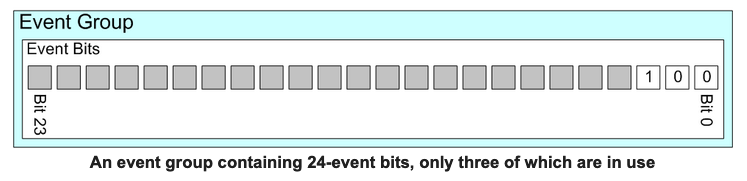

# イベントビット（フラグ）とイベントグループ

##  イベントビット（イベントフラグ）

イベントビットはイベントが発生したか否かを示すために使用されます。
イベントビットはしばしばイベント_フラグ_と呼ばれています。たとえば、
アプリケーションは

- 1がセットされた場合は「メッセージが受信され、処理の準備ができた」
  ことを意味し、0がセットされた場合は「処理待ちのメッセージはない」
  ことを意味するビット（またはフラグ）を定義します。
- 1がセットされた場合は「アプリケーションがネットワークに送信可能な
  メッセージをキューに入れた」ことを意味し、0がセットされた場合は
  「ネットワークに送信可能なメッセージはキューに入っていない」
  ことを意味するビット（またはフラグ）を定義します。
- 1がセットされた場合は「ネットワークにハートビートメッセージを
  送信する時間である」ことを意味し、0がセットされた場合は
  「まだハートビートメッセージを送信する時間ではない」ことを意味する
  ビット（またはフラグ）を定義します。

##  イベント・グループ

イベントグループはイベントビットの集合です。イベントグループ内の
個々のイベントビットはビット番号で参照されます。上記の例を次のように
拡大します。

- 「メッセージが受信され、処理の準備ができた」ことを意味するイベント
  ビットをイベントグループのビット番号0にします。
- 「アプリケーションがネットワークに送信可能なメッセージをキューに
  入れた」ことを意味するイベントビットをイベントグループのビット
  番号1にします。
- 「ネットワークにハートビートメッセージを送信する時間である」ことを
  意味するイベントビットをイベントグループのビット番号2にします。

##  イベントグループとイベントビットのデータ型

イベントグループは`EventGroupHandle_t`型の変数により参照されます。

イベントグループに実装されるビット（またはフラグ）の数は`TickType_t`
型の制御に`configUSE_16_BIT_TICKS`か`configTICK_TYPE_WIDTH_IN_BITS`の
どちらを使用したかにより異なります。

* イベントグループに実装されるビット（またはフラグ）の数は
  `configUSE_16_BIT_TICKS`に1が設定されている場合は8であり、
  `configUSE_16_BIT_TICKS`に0が設定されている場合は24です。
* イベントグループ内に実装されるビット（またはフラグ）の数は
  `configTICK_TYPE_WIDTH_IN_BITS`に`TICK_TYPE_WIDTH_16_BIT`Sが
  設定されている場合は8、`configTICK_TYPE_WIDTH_IN_BITS`に
  `TICK_TYPE_WIDTH_32_BITS`が設定されている場合は24、
  `configTICK_TYPE_WIDTH_IN_BITS`に`TICK_TYPE_WIDTH_64_BITS`が
  設定されている場合は56です。

`configUSE_16_BIT_TICKS`または`configTICK_TYPE_WIDTH_IN_BITS`への
依存はRTOSタスクの内部実装においてスレッドローカルストレージに
使用されるデータ型に起因します。

イベントグループのすべてのイベントビットは`EventBits_t`型の単一の
符号なし変数に格納されます。イベントビット0はビット位置0に、
イベントビット1はビット位置1などのように格納されます。

以下の画像は上で説明した3つのサンプルイベントを保持するために3つの
ビットを使用する24ビットのイベントグループを表しています。この
画像ではイベントビット2だけが設定されています。

##  イベントグループ関連のRTOS API関数

イベントグループ関連のAPI関数は、タスクがイベントグループに1つ以上の
イベントビットをセットしたり、イベントグループの1つ以上のイベント
ビットをクリアしたり、イベントグループの1つ以上のイベントビットが
セットされるのを待つために保留（タスクが処理時間を消費しないように
ブロック状態になる）したりすることができるように提供されています。

イベントグループはいわゆるタスクの「ランデブー」を作成してタスクの
同期することにも使用できます。タスク同期ポイントとは同期に参加して
いる他のすべてのタスクがその同期ポイントに到達するまでタスクが
ブロックされた状態（CPU時間を消費しない状態）で待機するアプリ
ケーションコード内の地点です。

##  イベントグループを実装する際にRTOSが克服しなければならない課題

イベントグループを実装する際にRTOSが克服しなければならない主な
課題は次の2つです。

1. ユーザアプリケーションにおける競合状態の発生の回避:

    イベントグループの実装は次のような場合にアプリケーションに
    競合状態を発生させます。

    - 個々のビット（またはフラグ）を誰がクリアするかが明確でない。
    - ビットをいつクリアするべきかが明確でない。
    - タスクがそのビット値をテストするAPI関数を終了した時点で
      ビットがセットまたはクリアされていたのかが明確でない
      （別のタスクや割り込みがそのビットの状態を変更したかも
      しれない）。

    FreeRTOSのイベントグループの実装はビットの設定、テスト、クリアが
    アトミックであることを保証するインテリジェンスを組み込むことにより
    競合状態の可能性を排除しています。スレッドローカルなストレージと
    API関数の戻り値を注意深く使用することでこれを可能にしています。

2. 非決定論の回避:

    イベントグループの概念は非決定論的な振る舞いを意味します。
    イベントグループ上でブロックされているタスクの数はわからない
    ので、イベントビットが設定されたときに、いくつの条件をテスト
    したり、タスクをブロック解除したりする必要があるかが
    わからないからです。

    FreeRTOSの品質基準では割り込みが無効になっている間や
    割り込みサービスルーチン内から非決定論的なアクションを実行する
    ことを**許しません**。イベントビットがセットされる時にこれらの
    厳しい品質基準を破らないようにするために

    - RTOSタスクからイベントビットがセットされる時に割り込みが
      依然として有効であることを保証するためにRTOSスケジューラの
      ロッキング機構が使用されています。
    - 割り込みサービスルーチンからイベントビットを設定しようと
      した時にビットを設定する動作をタスクに延期させるために
      集中型遅延割り込み機構が使用されています。

##  サンプルコード

サンプルコードスニペットがAPIドキュメントに記載されています。
また、標準的なデモタスクのセットであるEventGroupsDemo.cには包括的な
例が記載されています（ソースファイルは、FreeRTOSメインリポジトリの
`FreeRTOS/Demo/Common/Minimal`ディレクトリにあります）。
