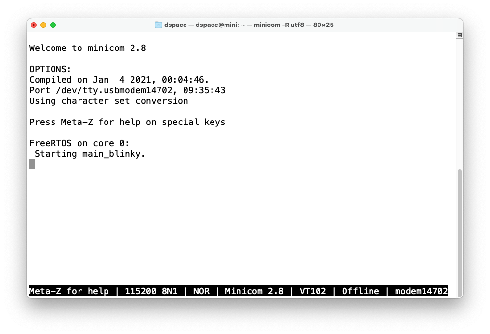
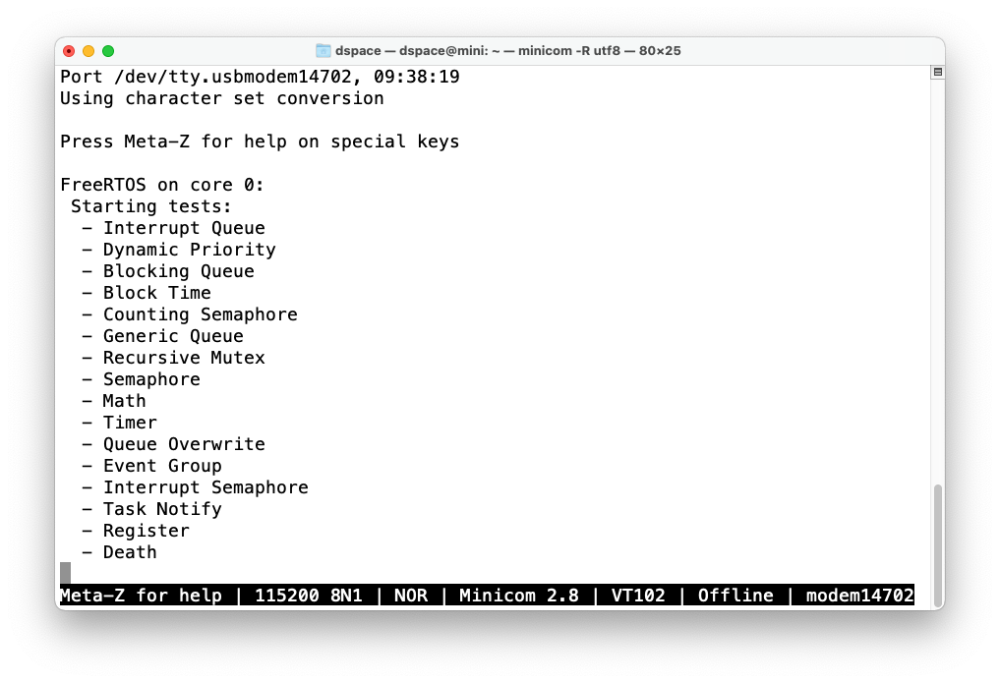
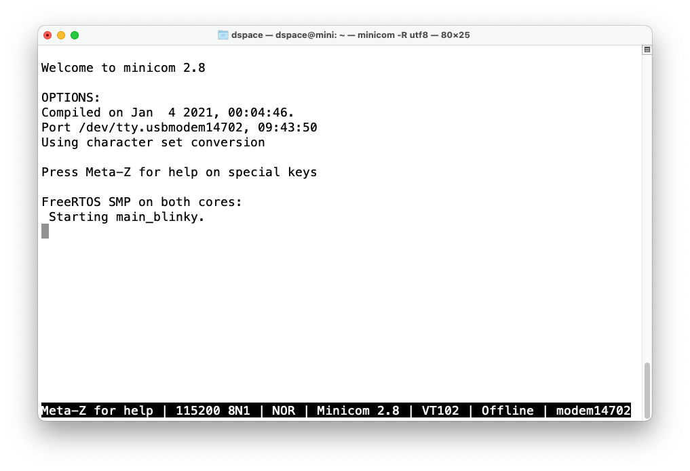
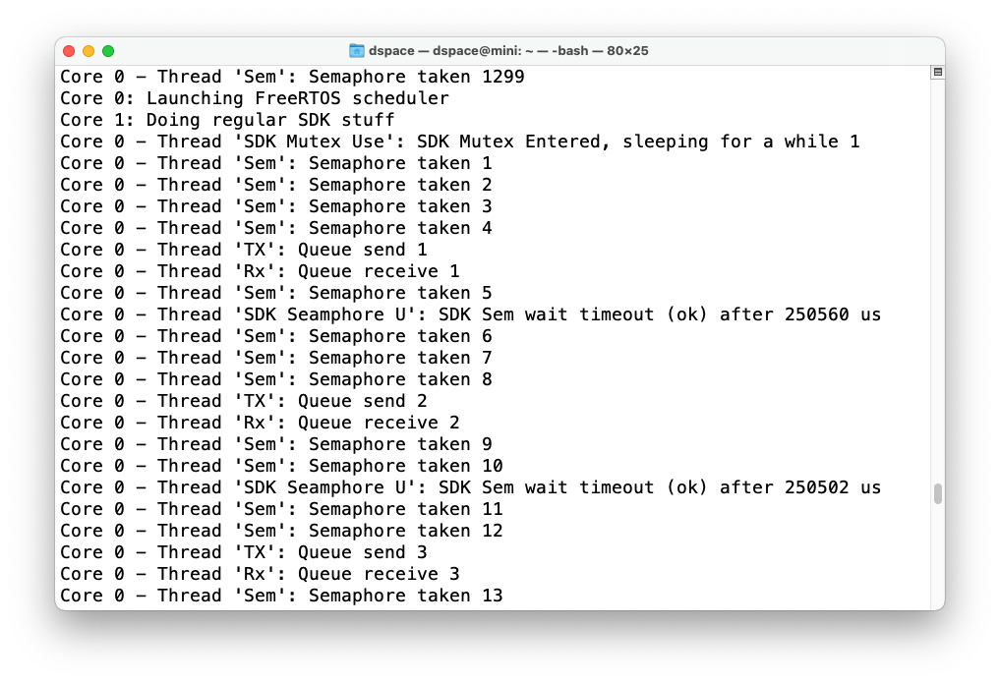
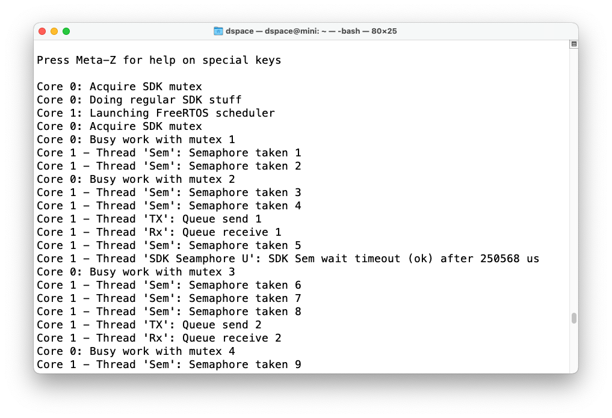
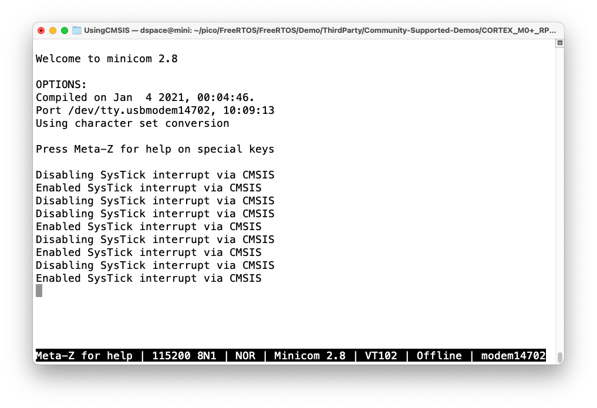

# BME280で測定した環境データをSSD1331に表示

try-kernelではデータは定期的に取得できるがSSD1331の表示が1回しか
できないという問題がいまだ未解決だが、FreeRTOSでは問題なくできた。

<video src="running.mov" controls></video>

# FreeRTOS仕様に関するメモ

1. `xQueueCreate()`はヒープを使うので`#define configSUPPORT_DYNAMIC_ALLOCATION 1`が必要
2. 各種フック関数は使わなくても問題ない(`FreeRTOSConfig.h`で設定)

# StandardとStandard_smpの違い

```diff
$ diff -ruw Standard/ Standard_smp/
diff -ruw Standard/FreeRTOSConfig.h Standard_smp/FreeRTOSConfig.h
--- Standard/FreeRTOSConfig.h	2024-03-02 09:28:40.000000000 +0900
+++ Standard_smp/FreeRTOSConfig.h	2024-03-02 09:28:40.000000000 +0900
@@ -83,10 +83,6 @@
 #define configUSE_TRACE_FACILITY                1
 #define configUSE_STATS_FORMATTING_FUNCTIONS    0

-/* Co-routine related definitions. */
-#define configUSE_CO_ROUTINES                   0
-#define configMAX_CO_ROUTINE_PRIORITIES         1
-
 /* Software timer related definitions. */
 #define configUSE_TIMERS                        1
 #define configTIMER_TASK_PRIORITY               ( configMAX_PRIORITIES - 1 )
@@ -101,7 +97,7 @@
 */

 /* SMP port only */
-#define configNUMBER_OF_CORES                   1
+#define configNUMBER_OF_CORES                   2
 #define configTICK_CORE                         0
 #define configRUN_MULTIPLE_PRIORITIES           0

@@ -134,5 +130,9 @@

 /* A header file that defines trace macro can be included here. */

+/* SMP Related config. */
+#define configUSE_PASSIVE_IDLE_HOOK             0
+#define portSUPPORT_SMP                         1
+
 #endif /* FREERTOS_CONFIG_H */

diff -ruw Standard/IntQueueTimer.c Standard_smp/IntQueueTimer.c
--- Standard/IntQueueTimer.c	2024-03-02 09:28:40.000000000 +0900
+++ Standard_smp/IntQueueTimer.c	2024-03-02 09:28:40.000000000 +0900
@@ -46,23 +46,35 @@

 void prvAlarm0Callback( uint timer )
 {
-    /* Argument timer is not used due to this callback fucntion is not reused and use first timer only. */
-    ( void )timer;
+    UBaseType_t uxSavedInterruptState;
+    BaseType_t xHigherPriorityTaskWoken;
+
     configASSERT(timer == 0);

-    BaseType_t xHigherPriorityTaskWoken = xFirstTimerHandler();
+    uxSavedInterruptState = taskENTER_CRITICAL_FROM_ISR();
+    {
+        xHigherPriorityTaskWoken = xFirstTimerHandler();
     hardware_alarm_set_target(0, make_timeout_time_us( FIRST_TIMER_PERIOD_US) );
+    }
+    taskEXIT_CRITICAL_FROM_ISR( uxSavedInterruptState );
+
     portEND_SWITCHING_ISR(xHigherPriorityTaskWoken);
 }

 void prvAlarm1Callback( uint timer )
 {
-    /* Argument timer is not used due to this callback fucntion is not reused and use second timer only. */
-    ( void )timer;
+    UBaseType_t uxSavedInterruptState;
+    BaseType_t xHigherPriorityTaskWoken;
+
     configASSERT(timer == 1);

-    BaseType_t xHigherPriorityTaskWoken = xSecondTimerHandler();
+    uxSavedInterruptState = taskENTER_CRITICAL_FROM_ISR();
+    {
+        xHigherPriorityTaskWoken = xSecondTimerHandler();
     hardware_alarm_set_target(1, make_timeout_time_us( SECOND_TIMER_PERIOD_US) );
+    }
+    taskEXIT_CRITICAL_FROM_ISR( uxSavedInterruptState );
+
     portEND_SWITCHING_ISR(xHigherPriorityTaskWoken);
 }

diff -ruw Standard/main.h Standard_smp/main.h
--- Standard/main.h	2024-03-02 09:28:40.000000000 +0900
+++ Standard_smp/main.h	2024-03-02 09:28:40.000000000 +0900
@@ -33,20 +33,15 @@
 /* These tests should work in all modes */
 #define mainENABLE_COUNTING_SEMAPHORE 1
 #define mainENABLE_DEATH 1
-
-/* TODO: This still seems flaky on SMP */
-#if ( portSUPPORT_SMP == 0)
     #define mainENABLE_INTERRUPT_QUEUE 1
-#endif
 #define mainENABLE_MATH 1
 #define mainENABLE_QUEUE_OVERWRITE 1
 #define mainENABLE_REG_TEST 1
 #define mainENABLE_SEMAPHORE 1
 #define mainENABLE_TASK_NOTIFY 1

-#if ( configNUMBER_OF_CORES != 2 ) || ( configRUN_MULTIPLE_PRIORITIES == 0 )
-
-/* These tests assume that a higher priority task will block a lower priority tax from running */
+#if ( configNUMBER_OF_CORES == 1 ) || ( configRUN_MULTIPLE_PRIORITIES == 0 )
+    /* These tests assume that a higher priority task will block a lower priority task from running */
 #define mainENABLE_BLOCK_TIME 1
 #define mainENABLE_BLOCKING_QUEUE 1
 #define mainENABLE_GENERIC_QUEUE 1
@@ -56,7 +51,7 @@
 #define mainENABLE_TIMER_DEMO 1
 #endif

-#if ( configNUM_CORES != 2 )
+#if ( configNUMBER_OF_CORES == 1 )
 /* This test just expects two tasks not to run concurrently */
 #define mainENABLE_DYNAMIC_PRIORITY 1
 #endif
```

# FreeRTOSのデモを実行

```bash
$ git clone https://github.com/FreeRTOS/FreeRTOS.git
$ cd FreeRTOS/FreeRTOS
$ git submodule update --init Source
$ cd Demo/ThirdParty
$ git submodule update --init Community-Supported-Demos
$ cd Community-Supported-Demos/CORTEX_M0+_RP2040
$ mkdir build
$ cd build
$ cmake ..
$ make
$ ls
CMakeCache.txt              Makefile      UsingCMSIS           pioasm
CMakeDoxyfile.in            OnEitherCore  cmake_install.cmake
CMakeDoxygenDefaults.cmake  Standard      elf2uf2
CMakeFiles                  Standard_smp  generated
$ find . -name *.uf2
./Standard_smp/main_full_smp.uf2
./Standard_smp/main_blinky_smp.uf2
./Standard/main_full.uf2
./Standard/main_blinky.uf2
./UsingCMSIS/using_cmsis.uf2
./OnEitherCore/on_core_one.uf2
./OnEitherCore/on_core_zero.uf2
```

## `Standard/main_blinky`



## `Standard/main_full`



## `Standard_smp/main_blinky`



## `Standard_smp/main_blinky`


## `OnEitherCore/on_core_zero`



## `OnEitherCore/on_core_one`



## `UsingCMSIS/using_cmsis`


