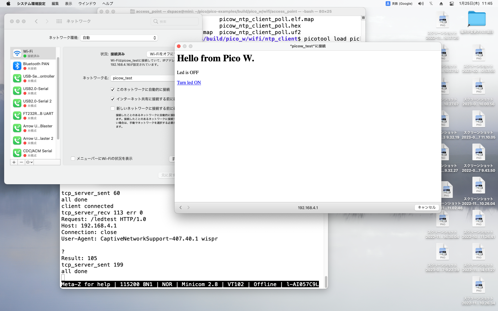

# Pico Wを使う

## 1. pico-sdkとpico-exampleをセットする

```bash
$ git clone https://github.com/raspberrypi/pico-sdk.git
$ cd pico-sdk
$ git submodule update --init
$ cd ..
$ git clone https://github.com/raspberrypi/pico-examples.git
$ cd pico-examples
$ git submodule update --init
```

## 2. プログラムをコンパイルする

```bash
$ mkdir build && cd build
$ cmake -DPICO_BOARD=pico_w -DWIFI_SSID="ssid" -DWIFI_PASSWORD="password" ..
  # パスワードにセミコロンを含む場合は"\\\;"でエスケープする
$ make picow_ntp_client_background
```

## 3. プログラムをpico wに書き込む

1. Bootselボタンを押しながらpico wをpcに接続
2. picotoolで書き込み

    ```bash
    $ cd pico_w/wifi/ntp_client/
    $ picotool load picow_ntp_client_background.uf2
    Loading into Flash: [==============================]  100%
    ```
3. pico wをアンマウント

## 4. プログラムを実行する

1. pico wとUSBシリアル変換器を接続: `pin1 (tx) -> rx, pin2 (rx) -> tx, pi3 (gnd)-> gnd`
2. USBシリアル変換器をpcに接続
3. pcのターミナルでminicomを立ち上げる

    ```bash
    $ minicom
    ```
4. pico wをbootselを押さずにpcに接続
5. minicomに実行結果が出力

    ```
    Welcome to minicom 2.8

    ntp address 162.159.200.1
    got ntp response: 19/01/2024 02:03:47
    ```

# セミコロンをエスケープしないとエラーが発生

```bash
$ cmake -DPICO_BOARD=pico_w -DWIFI_SSID="ssid" -DWIFI_PASSWORD="abc;123" ..
$ make picow_ntp_client_background
...
[  0%] Building C object pico_w/wifi/ntp_client/CMakeFiles/picow_ntp_client_background.dir/picow_ntp_client.c.obj
/bin/sh: -c: line 0: unexpected EOF while looking for matching `"'
/bin/sh: -c: line 1: syntax error: unexpected end of file
make[3]: *** [pico_w/wifi/ntp_client/CMakeFiles/picow_ntp_client_background.dir/picow_ntp_client.c.obj] Error 2
make[2]: *** [pico_w/wifi/ntp_client/CMakeFiles/picow_ntp_client_background.dir/all] Error 2
make[1]: *** [pico_w/wifi/ntp_client/CMakeFiles/picow_ntp_client_background.dir/rule] Error 2
make: *** [picow_ntp_client_background] Error 2

$ cat pico-examples/build/pico_w/wifi/ntp_client/CMakeFiles/picow_ntp_client_background.dir/flags.make
ASM_DEFINES = -D123" -DCYW43_LWIP=1 -DLIB_PICO_ASYNC_CONTEXT_THREADSAFE_BACKGROUND=1 -DLIB_PICO_BIT_OPS=1 -DLIB_PICO_BIT_OPS_PICO=1 -DLIB_PICO_CYW43_ARCH=1 -DLIB_PICO_DIVIDER=1 -DLIB_PICO_DIVIDER_HARDWARE=1 -DLIB_PICO_DOUBLE=1 -DLIB_PICO_DOUBLE_PICO=1 -DLIB_PICO_FLOAT=1 -DLIB_PICO_FLOAT_PICO=1 -DLIB_PICO_INT64_OPS=1 -DLIB_PICO_INT64_OPS_PICO=1 -DLIB_PICO_MALLOC=1 -DLIB_PICO_MEM_OPS=1 -DLIB_PICO_MEM_OPS_PICO=1 -DLIB_PICO_PLATFORM=1 -DLIB_PICO_PRINTF=1 -DLIB_PICO_PRINTF_PICO=1 -DLIB_PICO_RAND=1 -DLIB_PICO_RUNTIME=1 -DLIB_PICO_STANDARD_LINK=1 -DLIB_PICO_STDIO=1 -DLIB_PICO_STDIO_UART=1 -DLIB_PICO_STDLIB=1 -DLIB_PICO_SYNC=1 -DLIB_PICO_SYNC_CRITICAL_SECTION=1 -DLIB_PICO_SYNC_MUTEX=1 -DLIB_PICO_SYNC_SEM=1 -DLIB_PICO_TIME=1 -DLIB_PICO_UNIQUE_ID=1 -DLIB_PICO_UTIL=1 -DPICO_BOARD=\"pico_w\" -DPICO_BUILD=1 -DPICO_CMAKE_BUILD_TYPE=\"Release\" -DPICO_COPY_TO_RAM=0 -DPICO_CXX_ENABLE_EXCEPTIONS=0 -DPICO_CYW43_ARCH_THREADSAFE_BACKGROUND=1 -DPICO_EXTRAS=1 -DPICO_NO_FLASH=0 -DPICO_NO_HARDWARE=0 -DPICO_ON_DEVICE=1 -DPICO_TARGET_NAME=\"picow_ntp_client_background\" -DPICO_USE_BLOCKED_RAM=0 -DWIFI_PASSWORD=\"abc -DWIFI_SSID=\"ssod\"
...
```

- `-DWIFI_PASSWORD="abc;123"`が`-DWIFI_PASSWORD=\"abc`と`-D123"`に分割されてしまい、前者は
  ダブルクォーテーションで終わらず、後者はダブルクォーテーションで始まらないので、上記のエラーに
  なっているようだ。
- セミコロンは`\`でエスケープするが、`\;`ではシェルで`\`が諸費されてcmakeには`;`が渡ってしまうので、
  `\\\;`と`\`自身もエスケープする必要がある。

# pico_examples/pico_w/wifi/access_point

```bash
starting server on port 80
Try connecting to 'picow_test' (press 'd' to disable access point)
# macのwifiをオンにしてpicow_testに接続
client connected
tcp_server_recv 131 err 0
Request: /hotspot-detect.html HTTP/1.0
Host: captive.apple.com
Connection: close
User-Agent: CaptiveNetworkSupport-407.40.1 wispr?
Result: 0
Sending redirect HTTP/1.1 302 Redirect
Location: http://192.168.4.1/ledtest

tcp_server_sent 60
all done
client connected
tcp_server_recv 113 err 0
Request: /ledtest HTTP/1.0
Host: 192.168.4.1
Connection: close
User-Agent: CaptiveNetworkSupport-407.40.1 wispr

?
Result: 105
tcp_server_sent 199
all done
client connected
tcp_server_recv 347 err 0
Request: /hotspot-detect.html HTTP/1.1
Host: captive.apple.com
Upgrade-Insecure-Requests: 1
Accept: text/html,application/xhtml+x?
Result: 0
Sending redirect HTTP/1.1 302 Redirect
Location: http://192.168.4.1/ledtest

tcp_server_sent 60
all done
client connected
tcp_server_recv 329 err 0
Request: /ledtest HTTP/1.1
Host: 192.168.4.1
Upgrade-Insecure-Requests: 1
Accept: text/html,application/xhtml+xml,application/xml?
Result: 105
tcp_server_sent 199
all done
client connected
tcp_server_recv 131 err 0
Request: /hotspot-detect.html HTTP/1.0
Host: captive.apple.com
Connection: close
User-Agent: CaptiveNetworkSupport-407.40.1 wispr?
Result: 0
Sending redirect HTTP/1.1 302 Redirect
Location: http://192.168.4.1/ledtest

tcp_server_sent 60
all done
client connected
tcp_server_recv 113 err 0
Request: /ledtest HTTP/1.0
Host: 192.168.4.1
Connection: close
User-Agent: CaptiveNetworkSupport-407.40.1 wispr

?
Result: 105
tcp_server_sent 199
all done
client connected
tcp_server_recv 372 err 0
Request: /ledtest?led=1
Result: 105
tcp_server_sent 199
all done
client connected
tcp_server_recv 131 err 0
Request: /hotspot-detect.html HTTP/1.0
Host: captive.apple.com
Connection: close
User-Agent: CaptiveNetworkSupport-407.40.1 wispr?
Result: 0
Sending redirect HTTP/1.1 302 Redirect
Location: http://192.168.4.1/ledtest

# picoのLEDが点灯

tcp_server_sent 60
all done
client connected
tcp_server_recv 113 err 0
Request: /ledtest HTTP/1.0
Host: 192.168.4.1
Connection: close
User-Agent: CaptiveNetworkSupport-407.40.1 wispr

?
Result: 105
tcp_server_sent 199
all done
client connected
tcp_server_recv 378 err 0
Request: /ledtest?led=0
Result: 105
tcp_server_sent 199
all done
client connected
tcp_server_recv 131 err 0
Request: /hotspot-detect.html HTTP/1.0
Host: captive.apple.com
Connection: close
User-Agent: CaptiveNetworkSupport-407.40.1 wispr?
Result: 0
Sending redirect HTTP/1.1 302 Redirect
Location: http://192.168.4.1/ledtest

#  picoのLEDが消灯
# led=0を送信した場合の画面

tcp_server_sent 60
all done
client connected
tcp_server_recv 113 err 0
Request: /ledtest HTTP/1.0
Host: 192.168.4.1
Connection: close
User-Agent: CaptiveNetworkSupport-407.40.1 wispr

?
Result: 105
tcp_server_sent 199
all done
Disabling wifi
```



# picow_iperf_server_background

## pico_w

```bash
Connecting to Wi-Fi... (press 'd' to disconnect)
Connected.

Ready, running iperf server at 192.168.10.113
Completed iperf transfer of 0 MBytes @ 0.0 Mbits/sec
Total iperf megabytes since start 0 Mbytes
Disabling wifi
```

## mac

```bash
$ iperf3 -c 192.168.10.113 -p 5001 -J -t 2 --get-server-output
{
	"start":	{
		"connected":	[],
		"version":	"iperf 3.16",
		"system_info":	"Darwin mini.local 20.6.0 Darwin Kernel Version 20.6.0: Thu Jul  6 22:12:47 PDT 2023; root:xnu-7195.141.49.702.12~1/RELEASE_X86_64 x86_64"
	},
	"intervals":	[],
	"end":	{
	},
	"error":	"control socket has closed unexpectedly"
}
```

# pico-examples/i2c/bmp280_i2c

```bash
Hello, BMP280! Reading temperaure and pressure values from sensor...
id = 0x60
Pressure = 1015.69 hPa
Temp. = 27.11 C
Humidity. = 34.56 %
Pressure = 1015.69 hPa
Temp. = 27.11 C
Humidity. = 34.52 %
```
