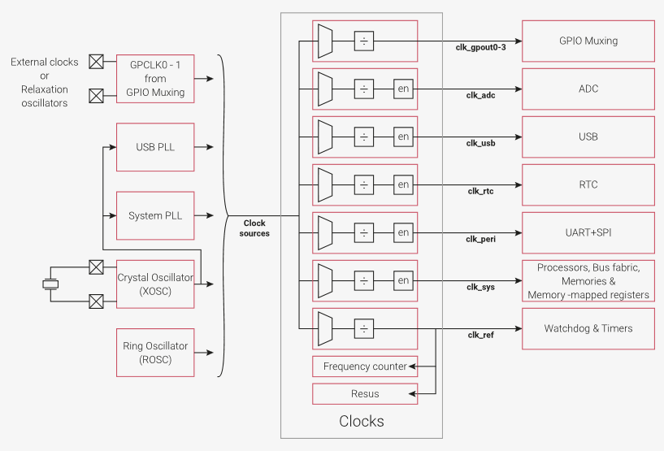
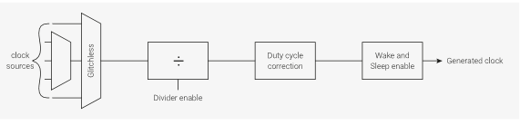

# 2.15 クロック

## 2.15.1 概要

クロックブロックは、オンチップコンポーネントと外部コンポーネントに
独立したクロックを提供します。様々なクロックソースから入力を受け
付けるのでコスト、ボード面積、消費電力と性能の間のトレードオフを
選択することができます。これらのソースから複数のクロックジェネレータ
を使用して必要なクロックを供給します。このアーキテクチャにより、
ユーザはクロックを独立して開始・停止したり、一部のクロックの周波数を
変化させる一方で他のクロックの周波数を最適な周波数に維持したりする
柔軟性が得られます。

正確なタイミングが要求されない超低コストまたは低電力アプリケーションの
場合、内蔵のリング発振器（ROSC）でチップを動作させることができます。
また、外部クロックを供給したり、GPIOと適切な外部受動素子を使用して
簡単な弛張型発振回路を構築することもできます。タイミングがより重要な
場合は、水晶発振器（XOSC）を正確なリファレンスとして2つのオンチップPLLに
提供し、正確な周波数で高速クロッキングを行うことができます。

クロックジェネレータはクロックソースを選択し、SLEEPモード（
セクション2.11.2参照）では自動的にクロックを停止するイネーブル
ロジックを介して出力する前に選択したクロックを任意に分周することが
できます。

オンチップ周波数カウンタはクロック設定のデバッグを容易にし、外部
クロックの周波数の測定も可能にします。オンチップresusコンポーネントは
システムクロックが誤って停止した場合に既知の適切なクロックから
システムクロックを再起動させます。これによりソフトウェアデバッガは
レジスタにアクセスすることができ、問題をデバッグすることができます。

チップにはDORMANTと呼ばれる超低消費電力モードがあり（セクション2.11.3を
参照）、このモードでは電力を節約するためにすべてのオンチップクロック
ソースが停止されます。外部ソースは停止しないので、DORMANTモードから
チップを起床させるためのアラー ムを提供するオンチップRTCにクロックを
供給するために使用することができます。また、外部イベントに応答して
チップをDORMANTモードから起床させるようにGPIO割り込みを設定することも
できます。

最大4つの生成クロックを最大50MHzでGPIOに出力できます。これにより
ユーザは外部デバイスにクロックを供給することができ、電力、スペース、
コストに敏感なアプリケーションで部品点数を削減できます。

## 2.15.2 クロックソース

RP2040はさまざまなクロックソースで動作させることができます。この
柔軟性により、性能、コスト、基板面積、消費電力を最適化するように
クロックを設定することができます。クロックソースには、オンチップの
リングオシレータ (2.17)、水晶発振器 (2.16)、GPIOからの外部クロック
(2.15.6.4)、PLL (2.18) があります。

クロックソースのリストはクロックジェネレータごとに異なり、`CTRL`
レジスタ内の列挙値として見つけることができます。例は`CLK_SYS_CTRL`を
参照してください。

[一部省略]

## 2.15.3 クロックジェネレータ

クロックジェネレータは標準設計に基づいて構築されており、クロック
ソースの多重化、分周、デューティサイクル補正、SLEEPモードの有効化が
組み込まれています。チップ面積と電力を節約するため、個々のクロック
ジェネレータがすべての機能をサポートしているわけではありません。

### 2.15.3.1 インスタンス

P2040は以下に示すクロックジェネレータを備えています。

| クロック | 説明 | 定格周波数 |
|:---------|:-----|:----------:|
| `clk_gpout0`   `clk_gpout1`   `clk_gpout2`   `clk_gpout3` | GPIOへのクロック出力。外部デバイスの計測や、ロジックアナライザーやオシロスコープによるオンチップクロックのデバッグに使用できる | N/A |
| `clk_ref` | DORMANTモードでない限り常に動作している基準クロック。電源投入時はリングオシレータ (ROSC) により動作するがより高精度にするために水晶発振器 (XOSC) に切り替えることができる | 6 - 12MHz |
| `clk_sys` | DORMANTモードでない限り常に動作しているシステムクロック。電源投入時は`clk_ref`で実行されるが、通常はPLLに切り替えられる | 125MHz |
| `clk_peri` | ペリフェラルクロック。通常は`clk_sys`で動作するが、ソフトウェアによって`clk_sys`が変更された場合にペリフェラルを一定の速度で動作させることができる | 12 - 125MHz |
| clk_usb | USB基準クロック。48MHzでなければならない | 48MHz |
| clk_adc | ADC基準クロック。48MHzでなければならない | 48MHz |
| clk_rtc | RTC基準クロック。RTCはこのクロックを分周して1秒のリファレンスを生成する | 46875Hz |

各クロックジェネレータのクロックソースの完全なリストについては該当する
`CTRL`レジスタ（たとえば、`CLK_SYS_CTRL`）を参照してください。。

## 2.15.7 レジスタ一覧

リセットコントローラのレジスタはベースアドレス `0x40008000`
（SDKでは`CLOCKS_BASE`で定義されている）から始まります。

| オフセット | レジスタ名 | 説明 |
|-----------:|:-----------|:-----|
| 0x04 | CLK_GPOUT0_DIV | クロック分周器、オンザフライで変更可能 |
| 0x08 | CLK_GPOUT0_SELECTED | グリッチレスmuxで現在選択されているSRCを示す (one-hot) |
| 0x0c | CLK_GPOUT1_CTRL | クロック制御、オンザフライで変更可能（auxsrcを除く） |
| 0x10 | CLK_GPOUT1_DIV | クロック分周器、オンザフライで変更可能 |
| 0x14 | CLK_GPOUT1_SELECTED | グリッチレスmuxで現在選択されているSRCを示す (one-hot) |
| 0x18 | CLK_GPOUT2_CTRL | クロック制御、オンザフライで変更可能（auxsrcを除く） |
| 0x1c | CLK_GPOUT2_DIV | クロック分周器、オンザフライで変更可能 |
| 0x20 | CLK_GPOUT2_SELECTED | グリッチレスmuxで現在選択されているSRCを示す (one-hot) |
| 0x24 | CLK_GPOUT3_CTRL | クロック制御、オンザフライで変更可能（auxsrcを除く） |
| 0x28 | CLK_GPOUT3_DIV | クロック分周器、オンザフライで変更可能 |
| 0x2c | CLK_GPOUT3_SELECTED | グリッチレスmuxで現在選択されているSRCを示す (one-hot) |
| 0x30 | CLK_REF_CTRL | クロック制御、オンザフライで変更可能（auxsrcを除く） |
| 0x34 | CLK_REF_DIV | クロック分周器、オンザフライで変更可能 |
| 0x38 | CLK_REF_SELECTED | グリッチレスmuxで現在選択されているSRCを示す (one-hot) |
| 0x3c | CLK_SYS_CTRL | クロック制御、オンザフライで変更可能（auxsrcを除く） |
| 0x40 | CLK_SYS_DIV | クロック分周器、オンザフライで変更可能 |
| 0x44 | CLK_SYS_SELECTED | グリッチレスmuxで現在選択されているSRCを示す (one-hot) |
| 0x48 | CLK_PERI_CTRL | クロック制御、オンザフライで変更可能（auxsrcを除く） |
| 0x4c | CLK_PERI_DIV | クロック分周器、オンザフライで変更可能 |
| 0x50 | CLK_PERI_SELECTED | グリッチレスmuxで現在選択されているSRCを示す (one-hot) |
| 0x54 | CLK_USB_CTRL | クロック制御、オンザフライで変更可能（auxsrcを除く） |
| 0x58 | CLK_USB_DIV | クロック分周器、オンザフライで変更可能 |
| 0x5c | CLK_USB_SELECTED | グリッチレスmuxで現在選択されているSRCを示す (one-hot) |
| 0x60 | CLK_ADC_CTRL | クロック制御、オンザフライで変更可能（auxsrcを除く） |
| 0x64 | CLK_ADC_DIV | クロック分周器、オンザフライで変更可能 |
| 0x68 | CLK_ADC_SELECTED | グリッチレスmuxで現在選択されているSRCを示す (one-hot) |
| 0x6c | CLK_RTC_CTRL | クロック制御、オンザフライで変更可能（auxsrcを除く） |
| 0x70 | CLK_RTC_DIV | クロック分周器、オンザフライで変更可能 |
| 0x74 | CLK_RTC_SELECTED | グリッチレスmuxで現在選択されているSRCを示す (one-hot) |
| 0x78 | CLK_SYS_RESUS_CTRL |  |
| 0x7c | CLK_SYS_RESUS_STATUS |  |
| 0x80 | FCO_REF_KHZ | 基準クロック周波数 (kHz) |
| 0x84 | FCO_MIN_KHZ | 最小pass周波数 (kHz)。オプション。pass/failフラグを使用しない場合は0に設定 |
| 0x88 | FCO_MAX_KHZ | 最大pass周波数 (kHz)。オプション。pass/failフラグを使用しない場合は0x1ffffffに設定 |
| 0x8c | FCO_DELAY | muxを落ち着かせるために周波数カウントの開始を遅延させる。遅延は基準クロック周期の倍数で測定される  |
| 0x90 | FCO_INTERVAL | テスト間隔は0.98us * 2**interval だが、ここでは1us * 2**intervalとする。デフォルトのテスト間隔は 250us |
| 0x94 | FCO_SRC | 周波数カウンタに送られるクロック。不要な場合は0をセット。このレジスタに書き込むと周波数カウントを開始する |
| 0x98 | FCO_STATUS | 周波数カウンタステータス |
| 0x9c | FCO_RESULT | 周波数測定結果。status_done=1 の時のみ有効 |
| 0xa0 | WAKE_EN0 | wakeモードでクロックを有効にする |
| 0xa4 | WAKE_EN1 | wakeモードでクロックを有効にする |
| 0xa8 | SLEEP_EN0 | sleepモードでクロックを有効にする |
| 0xac | SLEEP_EN1 | sleepモードでクロックを有効にする |
| 0xb0 | ENABL_EN0 | クロックイネーブルの状態を示す |
| 0xb4 | ENABL_EN1 | クロックイネーブルの状態を示す |
| 0xb8 | INTR | 生の割り込み |
| 0xbc | INTE | 割り込みイネーブル |
| 0xc0 | INTF | 割り込みの強制 |
| 0xc4 | INTS | マスク＆強制後の割り込みステータス |
