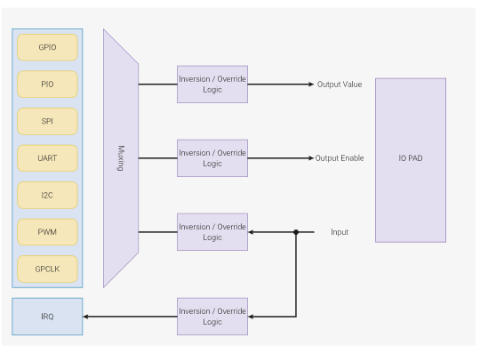
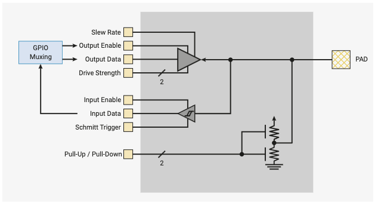

# 2.19 GPIO

## 2.19.4 パッド

各GPIOは「パッド」を介してチップ外の世界に接続されています。パッドはチップの
内部ロジックと外部回路との間の電気的インターフェースです。パッドは信号電圧
レベルを変換し、大電流をサポートし、静電気放電（ESD）からのある程度の保護機能を
提供します。パッドの電気的動作は外部回路の要件に合わせて調整できます。以下の
調整が可能です。

- 出力ドライブ強度を2mA、4mA、8mA、12mAに設定可能
- 出力スルーレートを低速または高速に設定可能
- 入力ヒステリシス（シュミットトリガーモード）の有効化が可能
- プルアップ/プルダウンの有効化が可能で、出力ドライバ無効時の出力信号
  レベルを設定可能
- 入力バッファの無効化が可能で、パッドが未使用、未接続、アナログ信号に
  接続されている際に消費電流を減らすことが可能

パッドの例を図37に示します。

パッドの出力イネーブル、出力データ、入力データの各ポートは、IO muxを介して
パッドを制御する機能に接続されています。その他のポートはすべて、パッド制御
レジスタにより制御されさます。このレジスタはパッドを制御する機能からの出力
イネーブル信号をオーバーライドすることでパッドの出力ドライバを無効にする
こともできます。パッド制御レジスタの例はGPIO0を参照してください。

パッドの出力信号レベルと許容可能な入力信号レベルはどちらもデジタルIO電源
（IOVDD）によって決定されます。IOVDDは1.8Vから3.3Vの間の任意の公称電圧にする
ことができますが、1.8Vの電源を供給したときに仕様を満たすには、パッドの
VOLTAGE_SELECTレジスタに1を書き込んでパッド入力閾値を調整する必要があります。
デフォルトではパッド入力閾値は2.5Vから3.3VのIOVDD電圧に対して有効です。
1.8Vの電圧でデフォルトの入力閾値を使用することは安全な動作モードですが、
仕様を満たさない入力閾値になります。

**警告**

> 1.8Vを超えるIOVDD電圧を使う場合、入力閾値を1.8Vに設定するとチップにダメージを
> 与える可能性があります。

パッドの入力閾値はバンクごとに調整され、ユーザIOバンク（IOバンク0）とQSPI IO
バンクに関連するパッド用に個別のVOLTAGE_SELECTレジスタがあります。しかし、
両バンクは同じデジタルIO電源（IOVDD）を共有しているので両レジスタには常に同じ
値を設定する必要があります。

パッドレジスタの詳細は"2.19.6.3 パッド制御 - ユーザバンク"と"2.19.6.4項 パッド制御 - QSPIバンク"で説明されています。
