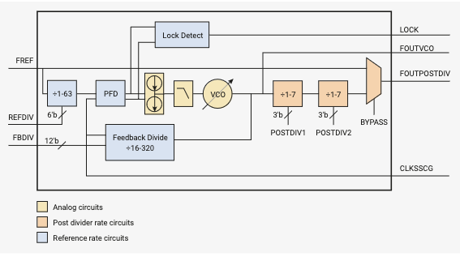

# 2.18 PLL

PLLは基準クロックを受け取り、フィードバックループを持つVCO
(Voltage Controlled Oscillator) を使って逓倍するように設計
されています。VCOは高周波数 (750 - 1600MHz) で動作する必要が
あるため、ポスト分周器と呼ばれる2つの分周器があり、チップ上の
クロックジェネレータに分配する前にVCO周波数を分周することが
できます。

RP2040には次の2つのPLLがあります。

- `pll_sys` - 最大133MHzのシステムクロックの生成に使用されます。
- `pll_usb` - 48MHzのUSB基準クロックの生成に使用されます。

## 2.18.2 PLLパラメタの計算

PLLの構成には基準クロックの周波数を知る必要があります。RP2040では
基準クロックは水晶発振器から直接ルーティングされます。RP2040の
USB bootromと互換性を持たせるために通常、12MHzの水晶振動子を使用
します。PLLの最終出力周波数である`FOUTPOSTDIV`は
`(FREF / REFDIV) × FBDIV / (POSTDIV1 × POSTDIV2)` で計算できます。
希望の出力周波数を念頭に置き、PLL設計における以下の制約に従って
PLLパラメータを選択する必要があります。

- 最小基準周波数 `(FREF / REFDIV)` は 5MHz である
- 発振器周波数 `(FOUTVCO)` は750MHz から 1600MHzの範囲であること
- フィードバック分周器 `(FBDIV)` は 16 から 320の範囲であること
- ポスト分周器 `(POSTDIV1、POSTDIV2)` は 1 から 7の範囲にあること
- 最大入力周波数 `(FREF / REFDIV)` はフィードバック分周器を最小にするためVCO周波数を16で割った値になる

さらに、チップのクロックジェネレータ（`FOUTPOSTDIV`に接続）の最大
周波数も尊重する必要があります。システムPLLは133MHz、USB PLLは48MHzです。
