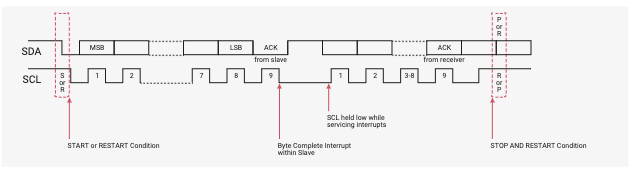

# 4.3 I2C

## 4.3.5 I2Cの動作

DW_apb_i2cはソフトウェアにより以下のように制御できます。

- I2Cマスターのみ（他のI2Cスレーブと通信） 、または
- I2Cスレーブのみ（1つ以上のI2Cマスターと通信）

マスターはクロックの生成とデータ転送の制御を行います。スレーブはマスターとの
間でデータの送受信を行います。データの肯定応答はデータを受信しているデバイス
（マスター、スレーブのどちらの場合もあります）によって送信されます。前述した
ように、I2Cプロトコルは複数のマスターがI2Cバスに常駐することを
許しており、バスの所有権を決定するために調停手順（アービテーション）を使用します。

各スレーブはシステム設計者によって決定される固有のアドレスを持っています。
マスターがスレーブと通信したい場合、マスターはSTART/RESTART条件を送信し、
その後にスレーブのアドレスと制御ビット（R/W）が続きます。この制御ビットは
マスターがデータを送信したいのか、スレーブからデータを受信したいのかを決定
します。その後、スレーブはアドレスの後にアクノリッジ（ACK）パルスを送信します。

マスター（マスターが送信者）がスレーブ（スレーブが受信者）に書き出している
場合、レシーバは1バイトのデータを取得する。このトランザクションはマスターが
STOP条件で送信を終了するまで続きます。マスターがスレーブ（マスターが受信者）から
読み込んでいる場合、スレーブは1バイトのデータをマスタに送信し（スレーブが送信者）、
マスターはACKパルスでトランザクションを確認します。このトランザクションは
マスターが最後のバイトを受信した後、トランザクションを確認しない（NACK）ことで
送信を終了し、マスターがSTOP条件を発行するか、RESTART条件を発行した後に別の
スレーブをアドレス指定するまで続きます。この動作を図65に示します。

DW_apb_i2cは同期シリアルインタフェースです。SDAラインは双方向の信号であり、
STOP、START、RESTART条件を除いて、SCLラインがLowの間だけ変化します。出力
ドライバはオープンドレインまたはオープンコレクタで、バス上でワイヤAND機能を
実行します。バス上の最大デバイス数は400pFの最大キャパシタンス仕様によって
のみ制限されます。データはバイトパッケージで伝送されます。

DW_apb_i2cで実装されているI2Cプロトコルについてはセクション4.3.6でされに詳しく
説明されています。

#### 4.3.5.1 START条件とSTOP条件

I2Cマスターとして動作している場合、送信FIFOにデータを入れると
DW_apb_i2cはI2Cバス上にSTART条件を生成します。IC_DATA_CMD.STOPに
1を書き込むとDW_apb_i2cはI2Cバス上にSTOP条件を生成します。このビットが
設定されていないと送信FIFOが空であってもSTOP条件は発行されません。

スレーブとして動作する場合、DW_apb_i2cはプロトコルにしたがいSTART条件と
STOP条件を生成しません。しかし、read要求があった場合、DW_apb_i2cはreadデータが
供給されるまでSCLラインをLowに保持します。これはスレーブDW_apb_i2cにreadデータが
供給されるか、IC_ENABLE.ENABLEに0を書き込んでDW_apb_i2cスレーブが無効になるまで
I2Cバスをストールさせます。

#### 4.3.5.2 複合フォーマット

DW_apb_i2cは7ビットと10ビットの両アドレッシングモードで、readとwriteが混在する
複合フォーマットトランザクションをサポートしています。ただし、は混合アドレスと
混合アドレスフォーマット、つまり、7ビットアドレストランザクションの後に10ビット
アドレストランザクションが続く、またはその逆の、複合フォーマット転送はサポート
していません。複合フォーマット転送を開始するには、IC_CON.IC_RESTART_ENを1に設定
する必要があります。この値が設定され、マスターとして動作している場合、DW_apb_i2cは
I2C転送を完了した際に送信FIFOをチェックし、次の転送を実行します。この転送の方向が
前の転送と異なる場合は、不幸号フォーマットを使用して転送が発行されます。現在の
I2C転送が完了したときに送信FIFOが空の場合、

- IC_DATA_CMD.STOPがチェックされ、
    - 1が設定されている場合はSTOPビットが発行され、
    - 0が設定されている場合は次のコマンドが送信FIFOに書き込まれるまでSCLはLowに
      保持されます。

詳細はセクション4.3.7を参照してください。
