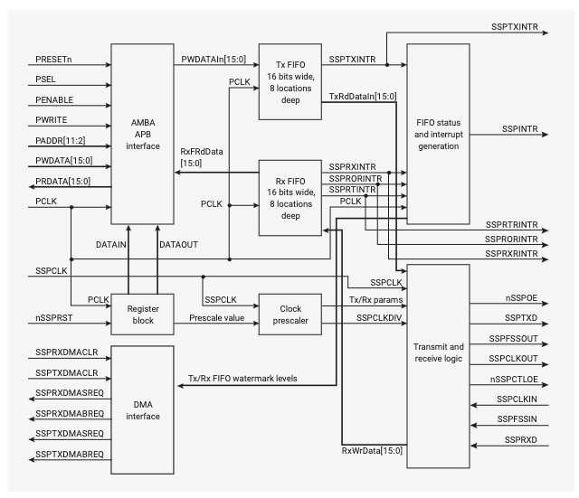
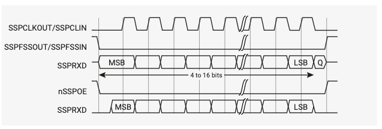

# 4.4 SPI

RP2040にはARM Primecell Synchronous Serial Port（SSP）（PL022）
（改訂 r1p4）をベースとする同一のSPIコントローラが2つあります。
これは4.10節で説明するQSPIインタフェースとは異なることに注意して
ください。

各コントローラは以下の機能をサポートしています。

- マスターまたはスレーブモード
    - Motorola SPI互換インタフェース
    - Texas Instrumentsの同期シリアルインタフェース
    - National Semiconductorのマイクロワイヤインタフェース
- 8深度のTx/Rx FIFO
- FIFOのサービスまたはエラー状態を示す割り込みの生成
- DMAからの駆動が可能
- プログラム可能なクロック速度
- プログラム可能なデータサイズ: 4 - 16ビット

各コントローラは2.19.2節で示したGPIOマルチプレクサ表 279で定義されているように
多くのGPIOピンに接続できます。GPIOマルチプレクサへの接続は、SPIインスタンス名で
あるspi0_ または spi1_ が先頭に付いた以下のピンがあります。

- クロックピン `SCLK` （コントローラがマスターモードで動作している場合は
  SSPCLKOUTに、スレードモードで動作している場合はSSPCLKINに接続します）。
- アクティブローのチップセレクトまたはフレーム同期ピン `ss_n`（以降の節では
  SSPFSSOUTと呼びます）。
- データ送信ピン `tx` （以降の節ではSSPTXDと呼びます。nSSPOEはtxパッドに接続されて
  いないため、出力データはSPIコントローラではトライステートされないことに
  注意してください）。
- データ受信ピン `rd`  (以下の節ではSSPRXDと呼びます)。

SPI TX ピンの機能は常にパッド出力イネーブルをアサートするように配線されており、
nSSPOEからは駆動されません。複数のSPIスレーブがバスを共有する場合、ソフトウェアは
出力イネーブルを切り替える必要があります。これは関連する`iobank0.ctrl`レジスタの
`oeover`フィールドをトグルするか、GPIO機能を切り替えることで可能です。

SPIはSPIタイミングの基準クロックとして`clk_peri`を使用します。以降の節では
SSPCLKと呼びます。`clk_sys`はバスクロックとして使用され、以降の節では
PCLKと呼びます（2.15.1節の参照してください）。

## 4.4.1 概要

PrimeCell SSPはMotorolaのSPI、National SemiconductorのMicrowire、Texas
Instrumentsの同期式シリアルインタフェースを持つペリフェラルとの同期式
シリアル通信用のマスタインタフェースまたはスレーブインタフェースです。

PrimeCell SSPはペリフェラルから受信したデータのシリアル・パラレル変換を
行います。CPUはAMBA APBインタフェースを通してデータ、制御、ステータスの
各情報にアクセスします。送受信パスは内部FIFOメモリでバッファリングされ、
送受信モードともに最大8個の16ビット値を独立に保存することができます。
シリアルデータはSSPTXDから送信され、SSPRXDに受信されます。

PrimeCell SSPは入力クロックSSPCLKからシリアル出力クロックSSPCLKOUTを生成
するためのプログラム可能なビットレートクロックの分周器とプリスケーラを備えて
います。ビットレートはSSPCLKの周波数の選択により2MHz以上までサポートされ、
最大ビットレートはペリフェラルにより決められます。

制御レジスタであるSSPCR0とSSPCR1を使用して、PrimeCell SSPの動作モード、
フレームフォーマット、サイズをプログラムすることができます。

以下の個別にマスク可能な割り込みが生成されます。

- SSPTXINTR は送信バッファのサービスを要求します
- SSPRXINTR は受信バッファのサービスを要求します
- SSPRORINTR は受信FIFOのオーバーラン状態を示します
- SSPRTINTR は受信FIFOにデータが存在する間にタイムアウトが発生したことを示します

個々の割り込みのいずれかがアサートされマスクされていないと単一の複合割り込みが
アサートされます。この割り込みはRP2040のプロセッサ割り込みコントローラに接続
されています。

これらの割り込みに加えて、DMAコントローラと接続するためのDMA信号が用意されて
います。

選択された動作モードに応じてSSPFSSOUT出力は以下のように動作します。

- Texas Instrumentsの同期シリアルフレームフォーマット用のアクティブHIGHの
  フレーム同期出力
- SPIおよびMicrowire用のアクティブLOWのスレーブセレクト。

## 4.4.2 機能説明

### 4.4.3.9 Motorola SPIフレームフォーマット

Motorola SPIインタフェースは4線式インタフェースであり、SSPFSSOUT信号は
スレーブセレクトとして動作します。Motorola SPIフォーマットの主な特徴は
SSPSCR0制御レジスタのSPOビットとSPHビットを使用してSSPCLKOUT信号の
非アクティブ状態と位相をプログラムできることです。

#### 4.4.3.9.1. SPO、クロックの極性

SPOクロック極性制御ビットが"LOW"の時、SSPCLKOUTピンに定常状態の"LOW"を
生成します。SPOクロック極性制御ビットが"HIGH"の場合、データ転送が行われて
いない時にSSPCLKOUTピンに定常状態の"HIGH"が生成されます。

#### 4.4.3.9.2. SPH, クロックの位相

SPH制御ビットはデータを捕捉するクロックエッジを選択し、状態を変更
できるようにします。最初のデータ捕捉エッヂの前にクロック遷移を許すか
許さないかにより送信される最初のビットに最も影響を与えます。

位相制御ビットがLOWの場合、データは最初のクロックエッジの遷移で捕捉されます
（クロックの立ち上がりで捕捉）。

位相制御ビットがHIGHの場合、データは2番め医のロックエッジの遷移で捕捉されます
（クロックのたち下がりで捕捉）。

### 4.4.3.10 Motorola SPIフォーマット: SP0=0. SPH=0

図90と図91はSPO=0, SPH=0の場合のMotorola SPIフレームフォーマットの連続送信信号
シーケンスを示しています。図90はSPO=0, SPH=0の場合のMotorola SPIフレーム
フォーマットの単一の送信信号シーケンスを示しています。

図90はSPO=0, SPH=0の場合のMotorola SPIフレームフォーマットの連続送信信号
シーケンスを示しています。

この構成では、アイドル期間では

- SSPCLKOUT (SCK) 信号は強制的にLOW
- SSPFSSOUT (CS) 信号は強制的にHIGH
- 送信データラインSSPTXD (TX) は任意で強制的にLOW
- nSSPOEパッドイネーブル信号は強制的にHIGH（これはRP2040のパッドには
  接続されていないことに注意）
- PrimeCell SSPがマスターとして構成されている場合、nSSPCTLOEラインはLOWになり、
  SSPCLKOUTパッドはアクティブLOWイネーブルでイネーブルになります
- PrimeCell SSPがスレーブとして構成されている場合、nSSPCTLOEラインはHIGHになり、
  SSPCLKOUTパッドはアクティブLOWイネーブルでディセーブルになります。

PrimeCell SSPがイネーブルになり、送信FIFOに有効なデータがあると、SSPFSSOUT
マスター信号がLOWに駆動されることで送信開始が開始されます。これにより、スレーブ
データをマスターのSSPRXD入力ラインへ置くことがイネーブルになります。nSSPOEラインが
LOWに駆動されるとマスターのSSPTXD出力パッドが有効になります。

SSPCLKOUTの半周期後、有効なマスターデータがSSPTXDピンに送信されます。マスター
データとスレーブデータの双方がセットされると、さらにSSPCLKOUTの半周期後にSSPCLKOUT
マスタークロックピンがHIGHになります。

データはSSPCLKOUT信号の立ち上がりエッジで捕捉され、立ち下がりエッジで伝搬され
ます。

シングルワード転送の場合、データワードの全ビットが転送されると、SSPFSSOUTラインは
最後のビットが取り込まれた後のSSPCLKOUTの1周期後にアイドル情報であるHIGHに
戻されます。

連続したバック・ツー・バック転送の場合は、各データワード転送の間事にSSPFSSOUT
信号をHIGHにする必要があります。これはスレーブセレクトピンがそのシリアル
ペリフェラルレジスタのデータをフリーズさせ、SPHビットがロジックゼロの場合、
それを変更することを許可しないためです。したがって、マスターデバイスはシリアル
ペリフェラルデータの書き込みを可能にするために各データ転送の間にスレーブ
デバイスのSSPFSSINピンを上げる必要があります。連続転送が終了すると、SSPFSSOUT
ラインは最後のビットが捕捉された後のSSPCLKOUTの1周期後にアイドル情報である
HIGHに戻されます。
