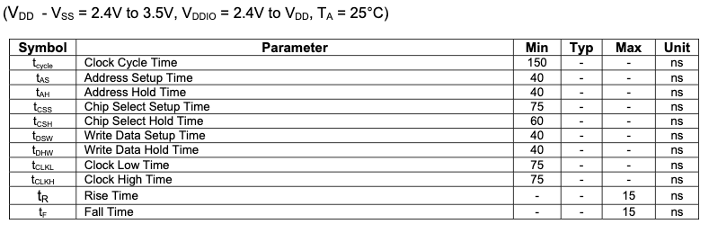

# SSD1331データシート

[オリジナル](ssd1331.pdf)

## 6. 端子の説明

| 端子名 | 端子型 | 説明 |
|:-------|:------:|:-----|
| BS[3:0] | I | MCUバスインタフェース選択端子<br/>0000: SPI |
| FR | O | RAM書き込み同期信号を出力します。<br/>MCUのデータ書き込みタイミングとフレーム表示タイミングを適切なタイミングにすることでティアリングの影響を防ぐことができます。<br/>使用しない場合はNCにしてください。 |
| CL | I | 外部クロック入力端子です。<br/>内部クロックが有効（CLS端子が "H"）の場合、この端子は使用されないのでVSSに接続する必要があります。内部クロックが無効（CLS 端子が "L"）の場合は外部クロック入力端子となります。 |
| CLS | I | 内部クロック選択端子です。<br/>Highにプルする（5V DDIOに接続する）と内部発振器がイネーブルになります(通常動作)。<br/>Lowにプルした場合は外部クロック信号をCLに接続する必要があります。 |
| CS# | I | MCUに接続するチップセレクト入力です。 |
| RES# | I | リセット信号入力です。<br/>LOWにするとチップの初期化が実行されます。<br/>通常動作時はHighにキープ（5V DDIOに接続）にしてください。 |
| D/C# | I | MCUに接続するデータ/コマンド制御端子です。<br/>Highにプルする（5V DDIOに接続）とD[15:0]のデータはデータとして解釈されます。<br/>LowにプルするとD[15:0]のデータはコマンドとして解釈されます。 |
| R/W# | I | MCUインタフェースに接続する読み取り/書き込み制御入力端子です。<br/>シリアルインタフェースを選択した場合はこの端子をVSSに接続する必要があります。 |
| E (RD#) | I | MCUインタフェース入力端子です。<br/>シリアルインタフェースを選択した場合はVSSに接続する必要があります。 |
| D[15:0] | I/O | MCUデータバスに接続する双方向データバスです。<br/>未使用の端子はLowにすることを推奨します（シリアルモードのD2ピンを除く） |
| SA[95:0]<br/>SB[95:0]<br/>SC[95:0] | O | OLEDセグメント駆動信号端子です。SET DISPLAY OFFコマンドで表示をOFFにするとハイインピーダンス状態になります。<br/>この 288のセグメント端子はSA,SB,SCの3グループに分かれおり、各グループには色A,B,Cの異なる設定が可能です。 |
| COM[63:0] | I/O | OLEDパネルのコモンスイッチ信号端子です。Set Display OFFコマンドで表示をOFFにするとハイインピーダンス状態になります。 |
| TR[11:0] | I | テスト用に予約されている端子です。フロート状態にしておく必要があります。 |
| NC | NC | ダミー端子です。フロート状態にしておき、他の信号ピンや電気信号に接続してはいけません。NC端子同士も接続してはいけません。 |


## 7 機能ブロックの説明

### 7.1 MCUインタフェースの選択

SSD1331のMCUインタフェースは16本のデータ端子と5本の制御端子で
構成されています。インタフェースモードでの端子配置を表4に示します。
MCUのインタフェースモードはBS[3:0]端子によるハードウェア選択で
設定できます（BS端子の設定については表3を参照してください）。

<center>表4 様々なバスインタフェースモードにおけるMCUインタフェース配置</center>


#### 7.1.3 シリアルインタフェース

シリアルインタフェースはシリアルクロック SCLK（D0）、シリアルデータ SDIN
（D1）、D/C#、CS#で構成されています。SCINはSCLKのエッジが立ち上がる毎に
D7, D6...D0の順で8ビットのシフトレジスタにシフトされます。D/C#は8クロック
毎にサンプリングされ、同時にシフトレジスタ内のデータバイトが表示データRAM
またはコマンドレジスタに書き込まれます。

シリアルモードでは書き込み操作しかできません。

<center>表8 シリアルインタフェースの制御端子</center>


<center>図8 SPIモードの書き込み手順</center>


### 7.2 コマンドデコーダ

このモジュールはD/C#端子に基づいて入力値をデータとして解釈するか、
コマンドとして解釈するかを決定します。

D/C#端子がHighの場合、データはGDDRAM (Graphic Display Data RAM) に
書き込まれます。Lowの場合、D0-D15の入力はコマンドとして解釈され、
デコードされて対応するコマンドレジスタに書き込まれます。

### 7.3 発振回路と表示タイムジェネレータ

#### 7.3.1 発振器


<center>図9 発振回路</center>

本モジュールはオンチップの低消費電力RC発振回路です (図9)。動作クロック (CLK) は
内部発振器、またはCLS端子による外部ソースCL端子のいずれかから生成されます。
CLS端子がHighの場合は内部発振器が選択されます。CLS端子がLowの場合はCL端子からの
外部クロックがCLKに使用されます。内部発振器F<sub>OSC</sub>の周波数はコマンド`B3h`
（発振器周波数設定コマンド）でプログラムできます。

表示タイミングジェネレータ用の表示クロック (DCLK) はCLKから派生します。
分周係数 "D" はコマンド`B3h`で1～16の範囲でプログラムできます。

DCLK = F<sub>OSC</sub> / D

表示のフレーム周波数は以下の式で決定されます。

F<sub>FRM</sub> = F<sub>OSC</sub> / (D x K x No. of Mux)

ここで、

- `D`はクロック分周比を表します。これはコマンド`B3h`の`A[3:0]`で設定します。
  分周比の範囲は1～16です。
- `K`は1行あたりの表示クロック数です。この値は<br/>以下の式で求められます。
        K = 第1相期間 + 第2相期間 + PW63(最長電流駆動パルス幅) <br/>
          = 4 + 7 + 125 = 136 (リセット時)
- マルチプレクス比はコマンド`A8h`で設定します。リセット値は64です。
- F<sub>OSC</sub>は発振周波数です。コマンド`B3h`の`A[7:4]`で調整できます。

#### 7.3.2 フレームの同期

フレーム同期信号はティアリング効果を防止するために使用することができます。


OLEDドライバに新しい画像を書き込む開始時間はMCUの書き込み速度に依存します。
MCUが1フレーム期間内にフレーム画像の書き込みを完了できる場合、高速書き込み
MCUに分類されます。MCUが書き込みを完了するのに長い時間を必要とする場合
（1フレーム以上2フレーム以内）、低速書き込みMCUに分類されます。

**高速書き込みMCUの場合**: MCUはFRパルスの立ち上がり直後にRAMデータの新しい
フレームの書き込みを開始し、次のFRパルスの立ち上がりよりも前に終了する必要が
あります。

**低速書き込みMCUの場合**: MCUは1番目のFRパルスの立ち下がりの後に新しい
フレームのRAMデータの書き込みを開始し、3番目のFRパルスの立ち上がりの前に
終了する必要があります。

### 7.4 リセット回路

RES#がLowに引き下げられるとチップは以下の状態で初期化されます。

1. 表示をオフ
2. 64 MUX表示モード
3. 表示開始行をディスプレイRAMのアドレス0に設定。
4. 表示オフセットを0に設定
5. ノーマルなセグメント、表示データ列アドレス、表示行アドレスのマッピング
  （SEG0をアドレス00Hにマップ、COM0を0に設定）
6. カラムアドレスカウンタを0に設定
7. マスターコントラスト制御レジスタを0FHに設定
8. カラーA、B、Cの個別コントラスト制御レジスタを80Hに設定
9. シリアルインタフェースのシフトレジスタデータをクリア
10. ノーマル表示モード（A4コマンドに相当）

### 7.5 GDDRAM (Graphic Display Data RAM)

#### 7.5.1 GDDRAMの構造

GDDRAMは表示するパターンを保持するビットマップスタティックRAMです。
RAMサイズは96 × 64 × 16ビットです。

機械的な柔軟性を確保するため、セグメント出力とコモン出力のどちらの
再マッピングもソフトウェアで選択できます。

ディスプレイを垂直方向にスクロールさせる場合は、表示開始ラインを格納
する内部レジスタを設定して、ディスプレイにマッピングするRAMデータの
割合を制御することができます。

各ピクセルは16ビットデータです。カラーA、B、C用の3つのサブピクセルは
各々5ビット、6ビット、5ビットです。

GDDRAM内のデータピクセルの配置を以下に示します。

<center>図10 65k色深度のGDDRAMの構造</center>


#### 7.5.2 各入力モードにおけるデータバスとRAMのマッピング

<center>表9 各バス幅と色深度モードのデータバス使用法</center>


#### 7.5.3 RAMマッピングと色深度モード

65K色深度モードではカラーA、B、CはRAMのコンテンツに直接マッピングされます。
256色モードでは、RAMのコンテンツは65kフォーマットになるように埋められます。

<center>図11 256色モードのマッピング</center>


### 7.8 コモンドライバとセグメントドライバ

セグメントドライバは288個 (96×3色) の電流源で構成されOLEDパネルを駆動します。
駆動電流はコントラスト設定コマンド (81h,82h,83h) により、0uAから160uAの間で
256段階で調整可能です。コモンドライバは走査電圧パルスを発生します。セグメント
ドライバとコモンドライバのブロック図と波形を以下に示します。

<center>図16 セグメントドライバとコモンドライバのブロック図</center>


コモンは行ごとに順次スキャンされます。ある行が選択されていない場合、図17に示すように
その行のすべての画素はそれらのコモンが電圧V<sub>COMH</sub>に駆動されることにより
逆バイアスになります。

スキャンされた行では対応するデータ信号がセグメントピンに送られることにより、その行の
画素がONまたはOFFされます。一方、画素がONになるとセグメントはI<sub>SEG</sub>に駆動されます。

<center>図17 セグメントドライバとコモンドライバの信号波形</center>


OLEDピクセルの駆動には4つのフェーズがあります。フェーズ1ではセグメント電極に沿った寄生容量に
蓄積された前のデータ電荷を放電するためにセグメントドライバによって画素がV<sub>LSS</sub>に
リセットされます。フェーズ1の期間はコマンド`B1h`の`A[3:0]`で1～15 DCLKの範囲でプログラムできます。
容量が大きいOLEDパネルの場合、放電にはより長い期間が必要です。

フェーズ2では、1回目のプリチャージが行われます。画素はV<sub>LSS</sub>から対応する電圧レベルVPに
達するように駆動されます。VPの振幅はコマンド`BBh`でプログラムすることができます。フェーズ2の
期間はコマンド`B1h`の`A[7:4]`で1～15 DCLKの範囲でプログラムできます。OLEDパネルのピクセルの
容量値が大きい場合、コンデンサを充電して所望の電圧に達するまでより長い期間が必要です。

フェーズ3では、2回目のプリチャージによってOLED画素を目標の駆動電圧まで駆動します。この2回目の
プリチャージは充電プロセスの速度を制御することができます。フェーズ3の期間はコマンド`8Ah`, `8Bh`,
`8Ch`でプログラムできます。

最後のフェーズ（フェーズ4）は電流駆動ステージです。セグメントドライバによる電流源が画素に定電流を
供給します。ドライバICはパルス幅変調（PWM）方式を採用して各画素のグレイスケールを個別に制御します。
電流駆動ステージのパルス幅が広いほど画素は明るくなり、その逆も同様です。これらを下図に示します。

<center>図18 セグメントのPWMによるグレイスケール制御</center>


フェーズ4が終了すると、ドライバICはフェーズ1に戻り、次の行の画像データを表示します。この4段階の
サイクルは、OLEDパネルの画像表示をリフレッシュするために連続的に実行されます。

フェーズ4の長さはコマンド`B8h` "グレイスケールテーブルを設定"、または、`B9h`”線形グレイスケール
のイネーブル"によって定義されます。このテーブルではグレイスケールは前のテーブルエントリーの長さを
参照してインクリメンタルな方法で定義されます。

### 7.9 電源 ON/OFF シーケンス

以下の図はSSD1331の推奨電源オン/オフシーケンスを示しています（V<sub>DD</sub>と
V<sub>DDIO</sub>は同電圧であると仮定しています）。

**電源オンシーケンス**

1. V<sub>DD</sub>とV<sub>DDIO</sub>の電源を入れます。
2. V<sub>DD</sub>と V<sub>DDIO</sub>が安定した後、RES#ピンを少なくとも
   3us (t<sub>1</sbu>) の間 Low (ロジックLow) にし、その後 HIGH (ロジックHIGH) に
   します。
3. RES#端子をLOW(ロジックL)にした後、少なくとも3us (t<sub>2</sub>) 待ちます。
   その後、V<sub>CC</sub>の電源を入れます。
4. V<sub>CC</sub>が安定した後、表示ONコマンド`AFh`を送信します。100ms(tAF)後に
   SEG/COMはONになります。


<center>図19 電源オンシーケンス</center>

**電源オフシーケンス**

1. 表示OFFコマンド`AEh`を送信します。
2. V<sub>CC</sub>の電源を切ります。
3. t<sub>OFF</sub>になるのを待ち、V<sub>DD</sub>とV<sub>DDIO</sub>の電源を
   切ります（ここで、最小のt<sub>OFF</sub=0mx, 通常はt<sub>OFF</sub>=100mx）。


<center>図20 電源オフシーケンス</center>

## 8 コマンド一覧

<center>基本コマンド


</center>

<center>グラフィックアクセラレーションコマンド


</center>

### 8.1 データの読み書き

GDDRAMからデータを読み出す場合、6800系のパラレルモードではR/W#(WR#)端子と
D/C#端子にHIGHを、8080系のパラレルモードではE(RD#)端子にLOWを、D/C#端子に
HIGHを入力します。シリアルモード動作ではデータ読み出しは行えません。

ノーマルデータ読み出しモードではデータ読み出しのたびにGDDRAMのカラム
アドレスポインタが自動的に1つずつ増加します。

また、最初のデータ読み出しの前にダミー読み出しが必要です。

GDDRAMにデータを書き込む場合、6800系のパラレルモードと8080系のパラレル
モードでは、R/W#(WR#)端子にLOWを、D/C#端子にHIGHを入力します。シリアル
インタフェースモードでは常に書き込みモードになっています。GDDRAMの
カラムアドレスポインタはデータを書き込むたびに自動的に1ずつ増加します。

<center>表11 アドレス増分表（自動）


</center>

#### 9.1.6 Set Re-map & Data Format (0xA0)

このコマンドには複数の構成項目があります。各ビットの設定について以下に示します。

- アドレス増分モード(A[0])<br/>
    A[0]に `0` をセットすると水平アドレス増分モードになります。GDDRAMが
    読み書きされると列アドレスポイントが自動的に1だけ増分されます。列アドレス
    ポインタが列終了アドレスに達すると、列アドレスポインタは列開始アドレスに
    リセットされ、行アドレスポイントが1だけ増分されます。水平アドレス増分
    モードでの行および列アドレスポイントの移動シーケンスを図23に示します。<br/>
    A[0]に `1` をセットすると垂直アドレス増分モードになります。GDDRAMが
    読み書きされると行アドレスポイントが自動的に1だけ増分されます。行アドレス
    ポインタが行終了アドレスに達すると、行アドレスポイントは行開始アドレスに
    リセットされ、列アドレスポイントが1だけ増分されます。垂直アドレス増分
    モードでの行および列アドレスポイントの移動シーケンスを図24に示します。

    <center>図23 水平アドレス増分モードのアドレスポインタの動き

    
    </center>

    <center>図24 垂直アドレス増分モードのアドレスポインタの動き

    
    </center>

- カラムアドレスマッピング (A[1])<br/>
    このコマンドビットはOLEDモジュールのセグメント信号を左から右、または、
    その逆に配置することで柔軟にレイアウトするためのものです。
    表示方向はGDDRAMの列0をSEG0端子にマッピングする方向（A[1]=0）とGDDRAMの
    列95をSEG0端子にマッピングする方向（A[1]=1）のいずれかです。両者の効果を
    図25に示します。

    <center>図25 列アドレスの例

    
    </center>

- RGBマッチング (A[2])<br/>
    このコマンドビットは、OLEDモジュールのセグメント信号をフィルタ設計に
    合わせて柔軟にレイアウトするためのものです。

- COM左右リマップ (A[3])<br/>
    このコマンドビットはCOM0を左側または右側に配置することでOLEDモジュールの
    コモン信号をフレキシブルにレイアウトできるようにするものです。端子配置の
    詳細は表12と図26を参照してください。

- COMスキャン方向リマップ (A[4])<br/>
    このビットはOLEDモジュールのコモン信号の柔軟なレイアウトのためにコモンの
    スキャン方向を上から下、 またはその逆にします。端子配列の詳細は表12と図26を
    参照してください。

- COM端子の偶奇分割 (A[5])<br/>
    このビットは COM端子の偶奇配置を設定します。<br/>
    A[5] = 0: COM端子の偶奇分割を無効にします。コモンの端子配置は、COM63 COM62 ...
    COM33 COM32 ... SC95 ... SA0 ... COM0 COM1 .... COM30 COM31の順になります。<br/>
    A[5] = 1: COM端子の偶奇配置を有効にします。コモンの端子配置は、COM63 COM61 ...
    COM3 COM1 .. .SC95 ... SA0 ... COM0 COM2.... COM60 COM62のように偶奇分割され
    ます。端子配置の詳細は表12と図26を参照してください。

- ディスプレイ色モード (A[7:6])<br/>
    65k、または256の色モードを選択します。異なるモードでのGDDRAMデータ
    フォーマットについては7.5節を参照してください。

<center>表12 アドレス増分表（自動）


</center>

<center>図 COM端子のアードウェア構成(MUX比: 64)


</center>

## AC特性

**条件（他に記載のない場合）**

```
電圧はV<sub>SS</sub>を基準とする
V<sub>DD</sub> = V<sub>DDIO</sub> = 2.4V - 3.5V
V<sub>CC</sub> = 8.0V - 18.0V
T<sub>A</sub> = 25 ℃
```

<center>表18 AC特性<center>


(1) `Fosc`は内部発振器の周波数値を表し、コマンド`B3h`の`A[7:4]=1101b` （初期値）の時に測定される。
(2) `D`は分周比を表す。
(3) `K`は1行あたりの表示クロック数を表す(RESET = 136、すなわち、phase1 DCLK +
    phase2 DCLK + phase3 DCLK = 4 + 7 + 125)。
(4) `N`はコマンド`A8h`で選択されたMUXの数を表す。

<center>表21 シリアルインタフェース(SPI)のタイミング特性<center>




<center>図39 シリアルインタフェース(SPI)のタイミング特性<center>
