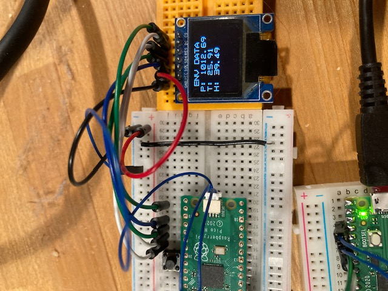

# Try Kernelを試す

Interface 2923年7月号掲載の`Try Kernel` OSを手元の
環境で実装してみる

## 実装概要

アプリケーションで使われているセンサーやモニターはいずれも手元に
ないため以下で代用する。

- 環境センサーBME280で気温、気圧、湿度を測定し、
- SSD1331 OLEDに表示する

BME280はI2C接続であるのでドライバが使える。SSD1331はSPI接続のため
ドライバも開発する必要がある。

## 追加/変更ファイル

### 追加ファイル

```bash
device/spi/dev_spi.h
device/spi/spi_rp2040.c
device/spi/spi_sysdep.h
application/bme280.c
application/bme280.h
application/font.h
application/oled.c
application/ssd1331.h
```

### 変更ファイル

```bash
application/app.h
device/devmgr/device.h
device/devmgr/device_tbl.c
```

## 実行1回目

スクリーンはおろか、コンソールにも何も表示されない

## デバッグ環境を整える

- [debugprobe](../debugprobe/debugprobe.md)を導入。
- gccの最適化レベルとデバッグレベルを変更

```diff
$ diff arm_toolchain.cmake
-set(COMMON_FLAGS "-Os -g -mthumb -march=armv6-m -fno-builtin -Wall -ffunction-sections -fdata-sections -fomit-frame-pointer -mabi=aapcs")
+set(COMMON_FLAGS "-O0 -g3 -mthumb -march=armv6-m -fno-builtin -Wall -ffunction-sections -fdata-sections -fomit-frame-pointer -mabi=aapcs")
```

### makeとdebugprobeによるpicoへの書き込み

```bash
cd trykernel
mkdir build
cd build
cmake ..
make
openocd -c "program try-kernel verify reset exit"
```

### デバッグ実行

端末を3つ使用する。

```bash
term1 $ minicom
term2 $ openocd
term3 $ cd trykernel ; gdb -x .gdbinit build/trykernel
```

## 発見した問題点と解決策

- ~~デバッグプリントが多いと競争状態になる~~
    - ~~追加していたデバッグプリントを削除した~~ これは別の問題だった
- SPIのレジスタ定義が間違っていた
    - フィールド定義の'<'を`<<`と修正
    - さらに固定値に書き換えた
- SPI CSNピンの機能はSPIではなくSIOにする必要があった

## 稼働



### 症状

- -O0では表示されるが、-Os/-O1,/-Ogでは表示されない
- ただし、表示は1度きりで更新されない
- リセットすると別の値が1回だけ表示される

### 実際のデータのチェック

1. BME280センサーは1秒ごとにデータをセットしている
2. 表示内容を格納するbufはデータの変更があるたびに変更されている
3. send_data() -> spi_write16_blocking() は正常に呼び出され処理されている
4. send_data()時のCS, DCの値も正しく出力されている
5. gccをupgradeしても変わらない(10.3-2021.10 -> 13.2.Rel1)
    `brew install gcc-arm-embedded`

```
# bit20: DC#, bit17: CS#
# 0x122: DC = 0, CN = 1
# 0x120: DC = 0, CN = 0
# 0x130: DC = 1, CN = 0
# 0x132: DC = 1, CN = 1
(gdb) c
Continuing.

Thread 1 "rp2040.core0" hit Breakpoint 1, send_data (buf=0x200051ac <tskstk_oled+20464>, size=6144) at /Users/dspace/pico/trykernel/application/oled.c:52
52	    spi_set_format(0, 16, SPI_CPOL_0,  SPI_CPHA_0, SPI_MSB_FIRST);
(gdb) n
53	    gpio_put(SPI_CSN_PIN, 0);   // チップセレクト
(gdb) p/x *(0xD0000004)
$10 = 0x1220033
(gdb) n
54	    gpio_put(SPI_DCN_PIN, 1);   // データモード
(gdb) p/x *(0xD0000004)
$11 = 0x1200033
(gdb) n
55	    tk_swri_dev(dd_spi0, SSD1331_DATA_MODE, buf, size, 0);
(gdb) p/x *(0xD0000004)
$12 = 0x1300033
(gdb) n
57	    gpio_put(SPI_CSN_PIN, 1);   // 連続出力の場合は必須
(gdb) p/x *(0xD0000004)
$13 = 0x1300033
(gdb) n
58	}
(gdb) p/x *(0xD0000004)
$14 = 0x1320033
```
